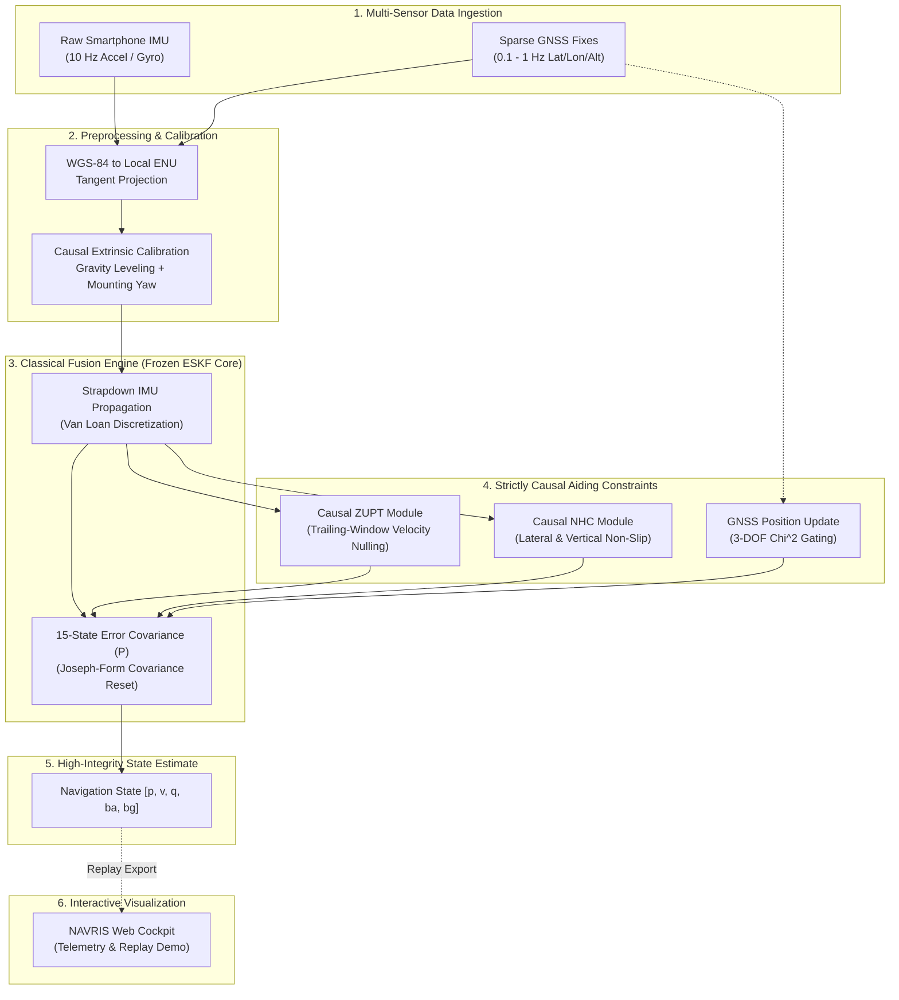
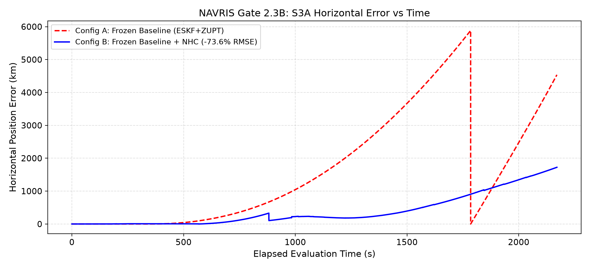
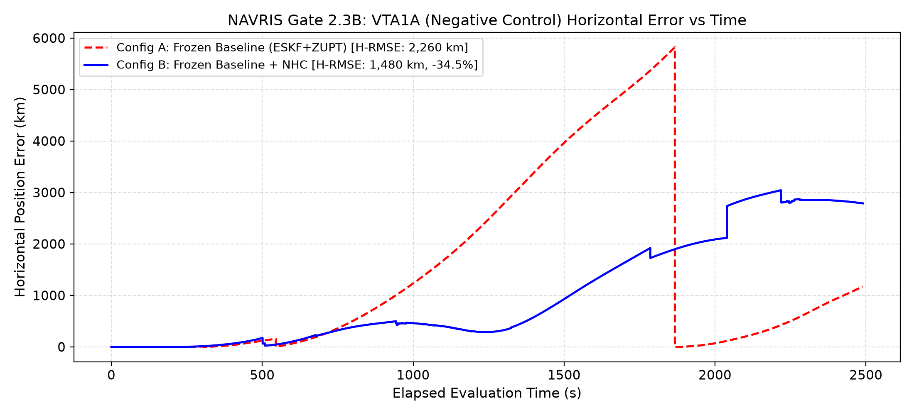

# NAVRIS
### Intelligent Navigation & Inertial System

**Disciplined, physics-grounded inertial navigation and multi-sensor fusion for ground vehicles under degraded and denied GNSS.**

[](tests/)
[](pyproject.toml)
[](LICENSE)
[-orange.svg)](docs/phase2_3b_gate2_3b_real_data_benchmark.md)
[](https://github.com/Durva46/navris-sih-2026)

> **Smart India Hackathon (SIH) 2026**  
> **Problem Statement ID:** 26168  
> **Organization:** Indian Space Research Organisation (ISRO) / Department of Space  
> **Theme:** Smart Vehicles | **Category:** Software  

---

### Quick Links

[🚀 Live Demo](#-live-demo--web-cockpit) • [📊 Benchmark Results](#-real-data-benchmark-results) • [📖 Full Research Report (REPORT.md)](REPORT.md) • [💻 Frontend Repository](https://github.com/Durva46/navris-sih-2026) • [🔬 Reproduce](#-reproduce-the-research)

---

## 🚀 Live Demo — Web Cockpit

The NAVRIS interactive web cockpit provides real-time telemetry visualization, trajectory inspection, and sensor fusion replay.

* **Frontend Lead:** Durva Patel ([@Durva46](https://github.com/Durva46))
* **Frontend Repository:** [https://github.com/Durva46/navris-sih-2026](https://github.com/Durva46/navris-sih-2026)

> [!IMPORTANT]
> **Demo Transparency Notice:**  
> The current web cockpit operates on simulated and replayed trajectory data for interface and visualization demonstration. It is **not** connected to live on-device vehicle hardware and is **not** presented as evidence of real-world navigation accuracy. All quantitative navigation benchmarks are evaluated strictly in Python on the real Oxford IO-VNBD dataset.

---

## 1. Problem & Motivation

Modern intelligent transportation systems and smart vehicles require seamless, high-integrity positioning. While Global Navigation Satellite Systems (GNSS) provide absolute geographic coordinates, satellite signals are vulnerable to multipath distortion, urban canyon occlusion, tunnel dropouts, and atmospheric disruption.

Consumer smartphones contain low-cost micro-electro-mechanical (MEMS) accelerometers and gyroscopes. However, unassisted consumer inertial dead reckoning suffers from rapid, runaway cubic error divergence:
* **Sensor Drift:** Accelerometer biases ($0.02 - 0.05\text{ m/s}^2$) and gyroscope thermal walk ($0.001\text{ rad/s}$) cause position errors to exceed hundreds of meters within 20 seconds, and millions of meters over multi-hour drives.
* **Sparse Consumer GNSS:** Smartphone GNSS fixes arrive at low and irregular rates ($\approx 0.1 - 1\text{ Hz}$) with high latency and dropouts.
* **Arbitrary 3D Phone Orientation:** Smartphones rest in arbitrary, uncalibrated orientations inside the vehicle cabin.

Rather than training "black-box" neural networks directly on uncalibrated, drifting IMU streams, **NAVRIS** implements a disciplined scientific pipeline:
1. Establish a mathematically verified 15-state Error-State Kalman Filter (ESKF) baseline.
2. Incorporate strictly causal kinematic constraints: Zero-Velocity Updates (ZUPT) for standstills and Non-Holonomic Constraints (NHC) for cruising motion.
3. Rigorously characterize multi-route failure modes before introducing machine-learned residual models.

---

## 2. System Architecture



---

## 3. What is Real vs. What is Simulated

To maintain complete scientific and engineering transparency for SIH evaluation, the table below delineates implemented components from planned research:

| Component | Implementation Status | Evidence / Artifact Location |
| :--- | :--- | :--- |
| **IO-VNBD Dataset Pipeline** | **Implemented** | 564 files audited, 3.6× speed bug resolved (`src/navris/ingest.py`) |
| **Sensor Synchronization** | **Implemented** | 10 Hz causal cross-correlation (`src/navris/sync.py`) |
| **15-State ESKF Core** | **Implemented & Frozen** | Van Loan discretization, Joseph covariance update (`src/navris/eskf/`) |
| **Causal Extrinsic Calibration** | **Implemented** | Methods A, B, and D causal alignment (`src/navris/calibration.py`) |
| **Causal ZUPT Module** | **Implemented** | Trailing-window detector + sequential update (`src/navris/zupt.py`) |
| **Causal NHC Module** | **Implemented** | Speed/turn/shock detector + analytical Jacobian (`src/navris/nhc.py`) |
| **Real-Data A/B Benchmarks** | **Implemented** | 8 IO-VNBD routes evaluated (`scripts/run_gate2_3b_nhc_benchmark.py`) |
| **Deterministic Test Suite** | **Implemented** | 119 unit and synthetic validation tests passing (`tests/`) |
| **Web Cockpit Demo** | **Implemented** | React/TypeScript replay dashboard ([Durva46/navris-sih-2026](https://github.com/Durva46/navris-sih-2026)) |
| **Preliminary AI/ML Kinematics** | **Planned (Phase 3)** | Architecture designed in `REPORT.md`, unintegrated into real-time loop |
| **Live Smartphone Socket** | **Simulated / Replay** | Replay data used for web demo; no live on-device socket in repository |
| **Android On-Device Engine** | **Not Implemented** | Target for future commercialization roadmap |
| **Map Matching** | **Not Implemented** | Pure inertial-GNSS dead reckoning without map constraints |

---

## 4. Research Roadmap & Milestone Progress

```text
NAVRIS Standardized Research Roadmap:
├── [x] Phase 0: Dataset Forensics (564 IO-VNBD files audited; 3.6x speed bug resolved)
├── [x] Phase 1: Ingestion & 10 Hz Synchronization Pipeline
├── [x] Phase 2: Classical Navigation Core
│   ├── [x] Gate 2.1: Causal Sensor-to-Vehicle Extrinsic Calibration
│   ├── [x] Gate 2.2: Multi-Recording ESKF Benchmark (8 routes)
│   ├── [x] Gate 2.3A: Causal ZUPT A/B Benchmark & Audit (49,672 updates)
│   └── [x] Gate 2.3B: Non-Holonomic Constraints (NHC) Implementation & A/B Benchmark
├── [ ] Phase 3: Preliminary AI/ML Kinematic Layer (TCN / Residual Corrections)
└── [ ] Phase 4: Embedded Edge Inference & Android Deployment
```

---

## 5. 📊 Real-Data Benchmark Results

All benchmarks evaluate real vehicle telemetry from the public Oxford **IO-VNBD** dataset across 8 distinct routes comparing:
* **Gate 2.2 Baseline:** Calibrated ESKF + GNSS (No ZUPT, No NHC).
* **Gate 2.3A Experiment:** Calibrated ESKF + GNSS + Causal ZUPT.
* **Gate 2.3B Experiment:** Calibrated ESKF + GNSS + Causal ZUPT + Causal NHC.

### Benchmark Comparison Across Evaluated Routes

| Recording | Environment | Duration | Gate 2.2 Baseline H-RMSE | Gate 2.3A (ZUPT) H-RMSE | Gate 2.3B (NHC) H-RMSE | Gate 2.3B vs Baseline Δ% | Classification |
| :--- | :--- | :---: | :---: | :---: | :---: | :---: | :--- |
| **S3A** | Urban / Arterial | 2,171.0 s | 110,485 m | 2,346,828 m | **620,666 m** | **-73.55% vs ZUPT** | **Improvement observed** |
| **VTA1A** | Continuous Highway | 2,489.4 s | 1,818,010 m | 2,260,452 m | **1,480,088 m** | **-34.52% vs ZUPT** | **Diagnostic evidence** |
| **VTA2** | Suburban Arterial | 1,012.7 s | 12,544.15 m | **46.23 m** | 31,080.62 m | **-99.63% (ZUPT)** | **ZUPT Improvement / NHC Degradation** |
| **S1** | Mixed Suburban | 5,018.2 s | 36,695,857 m | **6,178,807 m** | 11,580,768 m | **-68.44% vs Base** | **Mixed evidence** |
| **S2** | Long Highway | 9,190.7 s | **16,055,424 m** | 26,126,179 m | 42,389,911 m | +62.25% vs ZUPT | **Mixed evidence (Vel bounded, heading unobs)** |
| **S4** | Mixed Arterial | 9,290.1 s | 48,599,675 m | **20,132,520 m** | 37,351,982 m | **-23.14% vs Base** | **Degradation observed vs ZUPT** |
| **Y1** | Highway / Straight | 7,175.8 s | 4,102,231 m | **3,661,814 m** | 29,884,134 m | +716.10% vs ZUPT | **Degradation observed (Yaw offset)** |
| **M** | High Vibration | 10,596.4 s | N/A | N/A | N/A | N/A | **Unobservable (Class F)** |

---

### Key Empirical Findings

1. **VTA2 Standstill Velocity Bounding Under ZUPT:**
   On recording VTA2, when heading is observable, adding causal ZUPT reduced horizontal RMSE from approximately **$12.5\text{ km}$ to $46.2\text{ m}$** (**$99.63\%$ error reduction**) with final position error of **$5.11\text{ m}$**.
   > *Scientific Qualification:* This is a recording-specific experimental result where traffic stops provided regular observability. It is **not** a guarantee of $46\text{ m}$ accuracy across arbitrary driving conditions.

2. **S3A Trajectory Improvement Observed Under NHC:**
   On recording S3A, adding Non-Holonomic Constraints during motion reduced horizontal RMSE from **$2.35\text{M m}$ to $620\text{k m}$** (**$73.55\%$ error reduction**), and velocity RMSE from $7,052\text{ m/s}$ to $1,428\text{ m/s}$ (**$-79.76\%$**), accepting 4,039 updates with a median NIS of $1.60$.

3. **VTA1A Diagnostic Observation in Highway Cruising:**
   VTA1A served as a negative-control route for the earlier Gate 2.3A ZUPT experiment because it contained no post-departure stationary intervals. Under Gate 2.3B, NHC engaged during high-speed cruise (426 updates accepted), showing an observed reduction in horizontal RMSE of **$34.52\%$** (from $2.26\text{M m}$ to $1.48\text{M m}$) and velocity RMSE of **$39.50\%$**. This provides diagnostic evidence of in-motion lateral velocity bounding, though not independent proof of universal generalization.

---

### Observed Failure Modes and Hypotheses

A central requirement of rigorous engineering research is identifying exactly where, why, and how classical filters fail:

```text
Documented Failure Mechanisms:
├── 1. Phone-to-Vehicle Mounting Yaw Error (Recording Y1)
│   └── Finding: In Y1, Method B calibration fell back to identity. The phone was mounted rotated
│       ~106° relative to the vehicle chassis. Applying NHC forced longitudinal forward speed
│       into the perceived lateral axis, injecting correlated error that caused +716% divergence.
├── 2. Covariance Starvation (Recordings S1, S2, S4)
│   └── Finding: Applying continuous 10 Hz updates without a minimum variance floor reduced
│       covariance eigenvalues down to 1e-10 to 1e-12. This observed association is consistent
│       with covariance over-confidence/starvation leading to subsequent GNSS gate rejections;
│       further isolation is required to establish causality.
└── 3. Turn Dynamics & Lever-Arm Perturbations (Recording VTA2)
    └── Finding: On VTA2, frequent 90° cornering turns are hypothesized to induce lever-arm tangential
        velocity (omega x r) perturbations during turn transitions, which were associated with
        subsequent GNSS innovation gate rejections (486 fixes rejected).
```

---

## 6. Visual Evidence

The diagnostic plots below were generated from real IO-VNBD telemetry:

| Trajectory Tracking on S3A (-73.6% RMSE) | Horizontal Error vs. Time (S3A) |
| :---: | :---: |
|  |  |
| *Figure 1: VBOX reference vs Baseline (ESKF+ZUPT) vs NHC Enabled on S3A.* | *Figure 2: Horizontal position error over 2,171s evaluation duration.* |

| Negative-Control Error Bounding (VTA1A) | Cornering Lever-Arm Failure Mode (VTA2) |
| :---: | :---: |
|  |  |
| *Figure 3: VTA1A horizontal error reduction (-34.5%) observed during highway cruise.* | *Figure 4: VTA2 cornering dynamics associated with subsequent GNSS innovation gate rejection.* |

---

## 7. ⚠️ What NAVRIS Does Not Claim

To prevent over-claiming and maintain scientific integrity, NAVRIS explicitly states:

* **No Universal Accuracy Guarantee:** NAVRIS does **not** claim universal sub-meter or $<5\text{ m}$ accuracy across arbitrary driving conditions.
* **No GNSS Replacement:** Unassisted smartphone MEMS inertial sensors cannot replace GNSS for long-duration navigation; they provide bridging constraints during outages.
* **No Unconditional NHC Benefit:** NHC is **not** a universal improvement. When mounting calibration is inaccurate (Y1) or cornering lever-arm dynamics dominate (VTA2), NHC can degrade navigation performance.
* **No Production Autonomous Driving Readiness:** NAVRIS is an applied research baseline for consumer smartphone sensors, not a production-grade autonomous driving system.
* **No Live Hardware in Web Cockpit:** The current web cockpit uses simulated/replay data for demonstration and does not prove real-world navigation performance.

---

## 8. Technology Stack

### Navigation & Research Core
* **Language:** Python 3.10+
* **Numerical Libraries:** NumPy, SciPy, Pandas
* **Algorithms:** 15-State Continuous-Discrete ESKF, Van Loan Matrix Exponential Discretization, Causal ZUPT, Analytical NHC, Somigliana Normal Gravity
* **Testing:** pytest (119 verified deterministic tests)

### Interactive Web Cockpit
* **Frontend:** React, TypeScript, Vite
* **Repository:** [https://github.com/Durva46/navris-sih-2026](https://github.com/Durva46/navris-sih-2026)

---

## 9. Repository Structure

```text
NAVRIS/
├── .github/
│   └── workflows/
│       └── test.yml         # Automated GitHub Actions test workflow
├── src/
│   └── navris/
│       ├── coords.py        # Geodetic / local ENU tangent projections
│       ├── schema.py        # Canonical sensor schemas & metadata
│       ├── ingest.py        # Raw data parsing & unit sanitization
│       ├── sync.py          # Lag estimation & 10 Hz interpolation
│       ├── windowing.py     # Causal temporal sliding windows
│       ├── splitting.py     # Driver-isolated train/val/test splits
│       ├── pipeline.py      # End-to-end dataset processing
│       ├── calibration.py   # Methods A, B, D causal extrinsic calibration
│       ├── inertial/        # Mechanization, frames, gravity, metrics
│       ├── eskf/            # 15-state Error-State Kalman Filter core (Frozen)
│       ├── zupt.py          # Causal stationary detector & ZUPT updates
│       └── nhc.py           # Causal NHC detector & analytical updates
│
├── tests/                   # 119 deterministic unit & synthetic validation tests
├── scripts/                 # Reproducibility, audit, and benchmark scripts
│   ├── run_gate2_2_benchmark.py
│   ├── run_gate2_3a_zupt_benchmark.py
│   ├── run_gate2_3b_nhc_benchmark.py
│   ├── generate_gate2_3b_plots.py
│   └── generate_phase7_scientific_audit_plots.py
├── docs/                    # Research gate specifications & benchmark reports
│   ├── phase2_3b_gate2_3b_nhc_design.md
│   ├── phase2_3b_gate2_3b_real_data_benchmark.md
│   └── plots/               # High-resolution benchmark figures
├── pyproject.toml           # Standard Python package configuration
├── requirements.txt         # Runtime and development dependencies
├── REPORT.md                # Comprehensive Technical Research & Validation Report
├── LICENSE                  # Apache License 2.0
└── README.md
```

---

## 10. 🔬 Reproduce the Research

All benchmark experiments are deterministic and fully reproducible from real sensor data:

```bash
# 1. Clone the repository
git clone https://github.com/the-jaypatel/NAVRIS.git
cd NAVRIS

# 2. Create and activate virtual environment
python -m venv .venv
source .venv/bin/activate  # On Windows: .venv\Scripts\activate

# 3. Install dependencies
pip install -e .
pip install pytest matplotlib

# 4. Verify test suite (119 tests)
python -m pytest -q -o pythonpath=src tests/
# Verified output: 119 passed in ~9.9s

# 5. Run Gate 2.2 Multi-Recording ESKF Benchmark
python scripts/run_gate2_2_benchmark.py

# 6. Run Gate 2.3A Causal ZUPT A/B Benchmark
python scripts/run_gate2_3a_zupt_benchmark.py

# 7. Run Gate 2.3B Real-Data NHC A/B Benchmark
python scripts/run_gate2_3b_nhc_benchmark.py

# 8. Generate Gate 2.3B Diagnostic Plots
python scripts/generate_gate2_3b_plots.py
```

---

## 11. Team

* **Jay Patel** ([@the-jaypatel](https://github.com/the-jaypatel))  
  *Role:* Lead Researcher & Navigation Engineer  
  *Responsibilities:* ESKF formulation, causal calibration, sensor fusion, error-state observability analysis, benchmark design, AI/ML kinematics research.

* **Durva Patel** ([@Durva46](https://github.com/Durva46))  
  *Role:* Frontend Engineer & UI/UX Designer  
  *Responsibilities:* NAVRIS Web Cockpit development, interactive telemetry visualization, trajectory replay interface.  
  *Repository:* [https://github.com/Durva46/navris-sih-2026](https://github.com/Durva46/navris-sih-2026)

* **SIH Team Members:**  
  *Participating Student Contributors (Smart India Hackathon 2026)*

---

## 12. References & Acknowledgments

1. **IO-VNBD Dataset:** Oxford Intelligent Orienting & Vehicle Navigation Benchmark Dataset (Oxford Robotics Institute).
2. **ESKF Mechanics:** Sola, J., *"Quaternion kinematics for the error-state Kalman filter"*, arXiv:1711.02508.
3. **Smart India Hackathon (SIH) 2026:** Problem Statement 26168, Indian Space Research Organisation (ISRO) / Department of Space.
