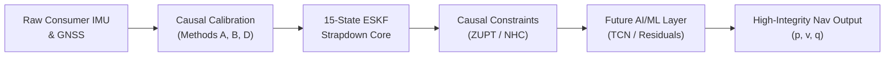

# NAVRIS — Intelligent Navigation & Inertial System
## AI-ML Based Intelligent Dead Reckoning for Seamless Navigation

[](tests/)
[](pyproject.toml)
[](LICENSE)
[-orange.svg)](docs/)

> **Smart India Hackathon (SIH) 2026**  
> **Problem Statement ID:** 26168  
> **Organization:** Indian Space Research Organisation (ISRO) / Department of Space  
> **Theme:** Smart Vehicles | **Category:** Software  

---

## 📖 Technical Research & Validation Report

For the exhaustive 22-section research report covering dataset forensics, classical ESKF derivation, controlled A/B benchmark metrics, and failure analysis, see:

👉 **[NAVRIS Technical Research & Validation Report (REPORT.md)](REPORT.md)** 👈

---

## 1. Overview & Problem Statement

Modern intelligent transportation and smart vehicles require seamless, high-integrity positioning. While Global Navigation Satellite Systems (GNSS) provide absolute geographic coordinates, satellite signals are vulnerable to multipath distortion, urban canyon occlusion, tunnel dropouts, and atmospheric disruption.

Consumer smartphones contain low-cost micro-electro-mechanical (MEMS) accelerometers and gyroscopes. However, unassisted consumer inertial dead reckoning suffers from rapid, runaway cubic error divergence:
- **Sensor Drift:** Accelerometer biases ($0.02 - 0.05\text{ m/s}^2$) and gyroscope thermal walk ($0.001\text{ rad/s}$) cause position errors to diverge into hundreds of meters within 20 seconds, and millions of meters over multi-hour drives.
- **Sparse Consumer GNSS:** Smartphone GNSS fixes arrive at low and irregular rates ($\approx 0.1 - 1\text{ Hz}$) with high latency.
- **Arbitrary 3D Phone Orientation:** Smartphones rest in arbitrary, uncalibrated orientations inside the vehicle cabin.

**NAVRIS** implements a disciplined, physics-grounded navigation pipeline. Rather than training end-to-end "black-box" neural networks on noisy, drifting sensor data, NAVRIS establishes a frozen 15-state Error-State Kalman Filter (ESKF) baseline, incorporates strictly causal kinematic constraints (Zero-Velocity Updates), and rigorously audits multi-route failure modes before introducing machine-learned residual models.

---

## 2. System Architecture



### Modular Pipeline Subsystems
- **Sanitization & Projection (`src/navris/coords.py`, `ingest.py`):** Converts raw sensor streams to canonical SI units and projects geodetic WGS-84 coordinates onto a local East-North-Up (ENU) Cartesian tangent plane.
- **Dynamic Synchronization (`src/navris/sync.py`):** Cross-correlation lag estimation aligning reference CAN/VBOX telemetry with smartphone data at 10 Hz.
- **Causal Extrinsic Calibration (`src/navris/calibration.py`):** Runtime gravity leveling (Method A) and horizontal mounting yaw alignment (Methods B & D).
- **Frozen ESKF Core (`src/navris/eskf/`):** 15-state continuous-discrete error-state filter with Van Loan matrix exponential discretization, 3-DOF $\chi^2$ innovation gating, and Joseph-form covariance reset.
- **Causal ZUPT Module (`src/navris/zupt.py`):** Strictly causal trailing-window stationary detector ($W=8$, $D=5$) applying direct velocity-nulling Kalman updates.

---

## 3. Current Research Status

> **Current Milestone: Phase 2.3B Gate 2.3A Audited — CONDITIONAL PASS / PARTIAL OBSERVABILITY**

```text
Progress Matrix:
├── [x] Phase 0: Dataset Forensics (564 IO-VNBD files audited; 3.6x speed bug resolved)
├── [x] Phase 1: Ingestion & 10 Hz Synchronization Pipeline
├── [x] Phase 2.1: Sensor Truth & Somigliana Earth Gravity Modeling
├── [x] Phase 2.2: Raw INS Baseline & Divergence Quantification
├── [x] Phase 2.3A: Classical 15-State ESKF Core (Frozen & Validated)
├── [x] Phase 2.3B Gate 2.1: Causal Sensor-to-Vehicle Calibration (S1 validated)
├── [x] Phase 2.3B Gate 2.2: Multi-Recording Generalization Benchmark (8 routes)
├── [x] Phase 2.3B Gate 2.3A: Causal ZUPT A/B Benchmark & Audit (49,672 updates)
├── [ ] Phase 2.3B Gate 2.3B: Non-Holonomic Constraints (NHC) Implementation
├── [ ] Phase 2.3B Gate 2.3C: Adaptive Covariance Fading Memory & Standstill Protection
├── [ ] Phase 3: Hybrid AI/ML Pseudo-Velocity & Error Estimation (TCN/GRU)
└── [ ] Phase 4: Embedded Edge Inference & Android Deployment
```

---

## 4. Controlled Real-Data A/B Benchmark Results

In Phase 7, NAVRIS evaluated a controlled A/B experiment across all eight recordings in the public **IO-VNBD** dataset. **Configuration A** evaluates the frozen Gate 2.2 baseline; **Configuration B** evaluates the identical pipeline with causal ZUPT enabled:

| Recording | Environment | Duration | H-RMSE A (Baseline) | H-RMSE B (ZUPT) | Δ H-RMSE | Final Error A | Final Error B | ZUPT Acc Rate | Evidence Classification |
| :--- | :--- | :---: | :---: | :---: | :---: | :---: | :---: | :---: | :--- |
| **VTA2** | Urban / Arterial | 1,012.7 s | 12,544.15 m | **46.23 m** | **-99.63%** | 70,540.65 m | **5.11 m** | **98.13%** (683/696) | **Positive Evidence** |
| **S1** | Arterial / Suburban | 5,018.2 s | 36,695,857 m | **6,178,807 m** | **-83.16%** | 83,936,485 m | 9,806,507 m | 1.09% (59/5400) | **Mixed Evidence** |
| **S4** | Mixed / Suburban | 9,290.1 s | 48,599,675 m | **20,132,520 m** | **-58.57%** | 673,448 m | 23,224,143 m | 0.59% (107/18065) | **Mixed Evidence** |
| **Y1** | Highway / Rural | 7,175.8 s | 4,102,231 m | **3,661,814 m** | **-10.74%** | 8,759,653 m | **2,783,398 m** | 1.60% (153/9553) | **Mixed Evidence** |
| **S2** | Arterial / High-Speed | 9,190.7 s | 16,055,424 m | 26,126,179 m | +62.72% | 34,187,673 m | 52,881,987 m | 0.01% (1/13653) | **Negative Evidence** |
| **S3A** | Stop-and-Go Arterial | 2,171.0 s | **110,485 m** | 2,346,828 m | +2024.12% | 561,309 m | 4,536,215 m | 31.38% (690/2199) | **Negative Evidence** |
| **VTA1A** | Continuous Cruise | 2,489.4 s | 1,818,010 m | 2,260,452 m | +24.34% | 1,649,949 m | 1,171,465 m | 69.81% (74/106) | **Negative Control** |
| **M** | Mountain Canyon | 10,596.4 s | N/A | N/A | N/A | N/A | N/A | N/A | **Unobservable (Class F)** |

### Key Empirical Findings
1. **The VTA2 Breakthrough:** When heading is observable, ZUPT repeatedly bounds velocity error during traffic stops, reducing horizontal RMSE by **99.63%** ($12.5\text{ km} \to \mathbf{46.2\text{ m}}$) and final position error to **$5.11\text{ m}$**.
2. **Filter Lockout (Pattern B):** In S2, unobservable initial heading caused velocity to diverge into thousands of m/s during motion. When stopped, the filter gated out ZUPT updates ($0.01\%$ acceptance).
3. **Covariance Starvation (Pattern E):** In S3A, applying 690 ZUPTs during an unexcited 327-second standstill collapsed velocity covariance, causing premature GNSS rejection at $t=422\text{ s}$ and post-departure divergence.
4. **Negative Control Verification (VTA1A):** Zero false-positive updates occurred during continuous highway cruise.

---

## 5. Repository Structure

```text
NAVRIS/
├── src/
│   └── navris/
│       ├── coords.py        # Geodetic / local ENU tangent projections
│       ├── schema.py        # Canonical sensor schemas & metadata
│       ├── ingest.py        # Raw data parsing & unit sanitization
│       ├── sync.py          # Lag estimation & 10 Hz interpolation
│       ├── windowing.py     # Causal temporal sliding windows
│       ├── splitting.py     # Driver-isolated train/val/test splits
│       ├── pipeline.py      # End-to-end dataset processing
│       ├── calibration.py   # Methods A, B, D causal extrinsic calibration
│       ├── inertial/        # Mechanization, frames, gravity, strapdown
│       ├── eskf/            # 15-state Error-State Kalman Filter core (Frozen)
│       └── zupt.py          # Causal stationary detector & ZUPT updates
│
├── tests/                   # Deterministic test suite (99 tests passing)
├── scripts/                 # Reproducibility, audit, and benchmark scripts
├── docs/                    # Complete research reports (Phase 0 -> Gate 2.3A)
├── data/
│   ├── README.md            # Dataset acquisition and setup guide
│   └── processed/           # Processed benchmark and audit artifacts
│
├── pyproject.toml           # Standard Python package configuration
├── requirements.txt         # Runtime and development dependencies
├── REPORT.md                # Comprehensive Technical Research & Validation Report
├── LICENSE                  # Apache License 2.0
└── README.md
```

---

## 6. Reproducibility

### Setup & Testing
```bash
# Clone the repository
git clone https://github.com/the-jaypatel/NAVRIS.git
cd NAVRIS

# Create virtual environment
python -m venv .venv
source .venv/bin/activate  # On Windows: .venv\Scripts\activate

# Install package
pip install -e .

# Run test suite
python -m pytest -q -o pythonpath=src tests/
# Output: 99 passed in ~8s
```

### Reproducing Benchmark Artifacts
```bash
# 1. Run Gate 2.3A Causal ZUPT A/B Benchmark across all 8 routes
python scripts/run_gate2_3a_zupt_benchmark.py

# 2. Generate Phase 8 Scientific Audit CSV & JSON
python scripts/generate_phase7_scientific_audit_data.py

# 3. Generate Diagnostic Plots (saved to data/processed/phase2_3b/gate2_3a/plots/)
python scripts/generate_phase7_scientific_audit_plots.py
```

---

## 7. Research Integrity: What NAVRIS Does Not Claim

1. **We Do Not Claim AI Solves Dead Reckoning Today:** AI/ML is presented strictly as a planned future layer; no fabricated accuracy numbers are reported.
2. **We Do Not Hide Negative Results:** Filter lockouts (S2), covariance starvation (S3A), and transient jump coupling (S1) are fully documented.
3. **We Do Not Tune Parameters Post-Hoc:** All detector thresholds and filter covariance matrices were declared and frozen prior to real-data evaluation.
4. **We Do Not Claim Universal Navigation Accuracy:** Consumer smartphone IMUs cannot provide autonomous long-duration navigation without external aiding.

---

## 8. Research Team

- **Lead Researcher & Engineer:** Jay Patel ([@the-jaypatel](https://github.com/the-jaypatel))
- **Affiliation:** NAVRIS Applied Navigation Research Project  
- **Competition:** Smart India Hackathon (SIH) 2026 | ISRO / Department of Space
