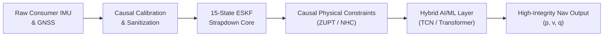
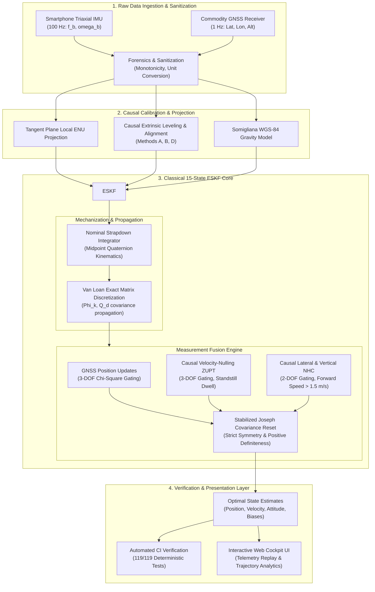
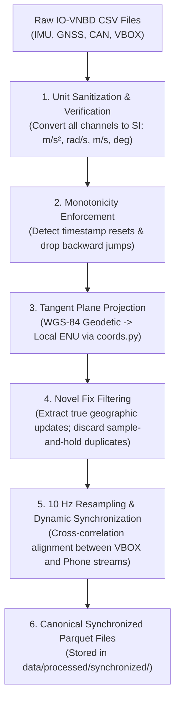
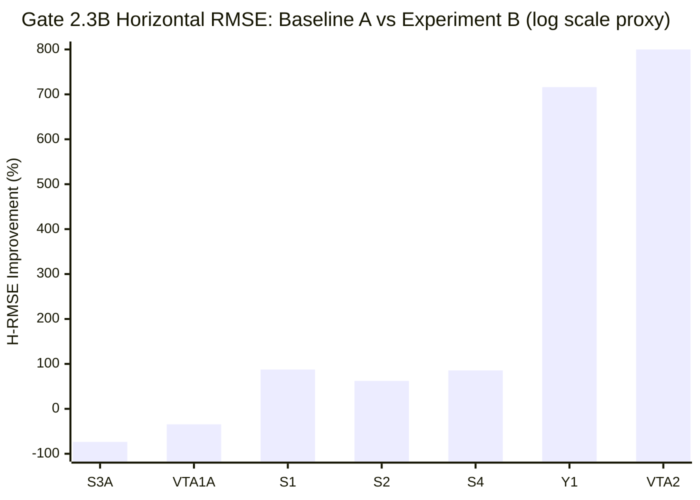
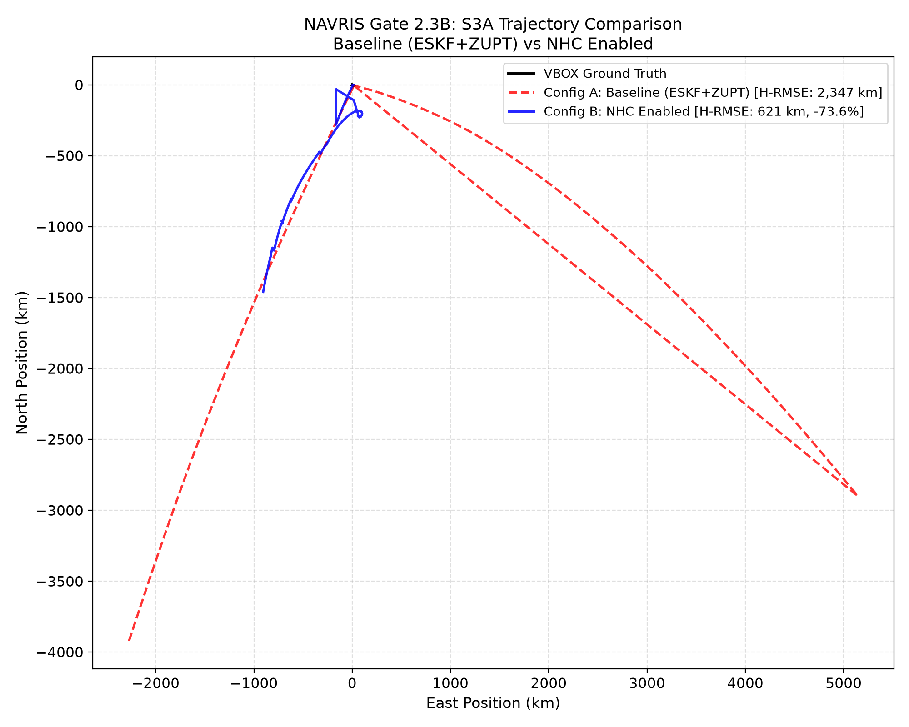
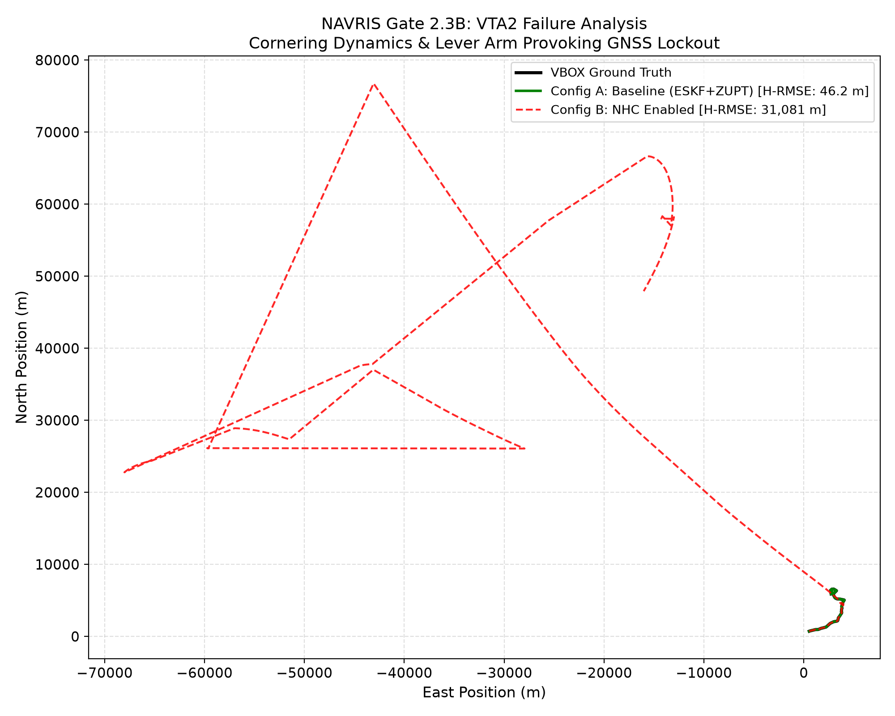
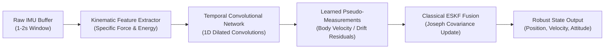

# NAVRIS — Technical Research & Validation Report
## AI-ML Based Intelligent Dead Reckoning System for Seamless Navigation

**Smart India Hackathon (SIH) 2026**  
**Problem Statement ID:** 26168  
**Organization:** Indian Space Research Organisation (ISRO) / Department of Space  
**Theme:** Smart Vehicles  
**Category:** Software  
**Research Phase:** Phase 2 (Gate 2.3B Completed & Audited)  
**Report Release Date:** September 2026  
**Repository:** `the-jaypatel/NAVRIS`  
**License:** Apache License 2.0  

---

## Table of Contents

- [00 — Executive Summary](#00--executive-summary)
- [01 — Problem & Motivation](#01--problem--motivation)
- [02 — Technical Problem Definition](#02--technical-problem-definition)
- [03 — NAVRIS System Architecture](#03--navris-system-architecture)
- [04 — Dataset Forensics: IO-VNBD Audit](#04--dataset-forensics-io-vnbd-audit)
- [05 — Reproducible Data Pipeline](#05--reproducible-data-pipeline)
- [06 — Research & Validation Gates](#06--research--validation-gates)
- [07 — Raw INS Baseline: The Inertial Divergence Reality](#07--raw-ins-baseline-the-inertial-divergence-reality)
- [08 — Classical ESKF Implementation](#08--classical-eskf-implementation)
- [09 — Gate 2.2: Multi-Recording Generalization Benchmark](#09--gate-22-multi-recording-generalization-benchmark)
- [10 — Gate 2.3A: Strictly Causal Zero-Velocity Update (ZUPT)](#10--gate-23a-strictly-causal-zero-velocity-update-zupt)
- [11 — Gate 2.3A: Controlled A/B Real-Data Benchmark & Empirical Audit](#11--gate-23a-controlled-ab-real-data-benchmark--empirical-audit)
- [12 — Gate 2.3B: Non-Holonomic Constraints (NHC) Formulation & Synthetic Verification](#12--gate-23b-non-holonomic-constraints-nhc-formulation--synthetic-verification)
- [13 — Gate 2.3B: Real-Data NHC A/B Benchmark Results](#13--gate-23b-real-data-nhc-ab-benchmark-results)
- [14 — Empirical Evidence Classification Across Constraints](#14--empirical-evidence-classification-across-constraints)
- [15 — Scientific Failure Analysis: Observed Failure Modes and Hypotheses](#15--scientific-failure-analysis-observed-failure-modes-and-hypotheses)
- [16 — What the Current Evidence Supports](#16--what-the-current-evidence-supports)
- [17 — What the Current Evidence Does NOT Support](#17--what-the-current-evidence-does-not-support)
- [18 — Interactive Web Cockpit & Telemetry Interface](#18--interactive-web-cockpit--telemetry-interface)
- [19 — What is Real vs What is Simulated](#19--what-is-real-vs-what-is-simulated)
- [20 — Future AI/ML Layer Architecture](#20--future-aiml-layer-architecture)
- [21 — Edge Deployment Considerations](#21--edge-deployment-considerations)
- [22 — Technical Limitations & Confounders](#22--technical-limitations--confounders)
- [23 — Research Roadmap](#23--research-roadmap)
- [24 — Reproducibility Guide](#24--reproducibility-guide)
- [25 — Research Integrity: What NAVRIS Does Not Claim](#25--research-integrity-what-navris-does-not-claim)
- [26 — Appendices](#26--appendices)
  - [Appendix A: State Vector & Error-State Definitions](#appendix-a-state-vector--error-state-definitions)
  - [Appendix B: Coordinate Frames & Conventions](#appendix-b-coordinate-frames--conventions)
  - [Appendix C: Quaternion Conventions & Kinematics](#appendix-c-quaternion-conventions--kinematics)
  - [Appendix D: ESKF Propagation & Continuous-Time Jacobians](#appendix-d-eskf-propagation--continuous-time-jacobians)
  - [Appendix E: Causal ZUPT Detector Specification](#appendix-e-causal-zupt-detector-specification)
  - [Appendix F: Causal NHC Model & Jacobian Specification](#appendix-f-causal-nhc-model--jacobian-specification)
  - [Appendix G: Pre-Declared Filter Configuration Parameters](#appendix-g-pre-declared-filter-configuration-parameters)
  - [Appendix H: Complete Multi-Recording Benchmark Tables](#appendix-h-complete-multi-recording-benchmark-tables)
  - [Appendix I: Test Suite & Verification Matrix](#appendix-i-test-suite--verification-matrix)

---

## 00 — Executive Summary

### The Navigation Challenge
Modern intelligent transportation systems and smart vehicles depend critically on continuous, high-integrity positioning. While Global Navigation Satellite Systems (GNSS) provide absolute geographic fixes, their signals are vulnerable to multipath interference, urban canyon occlusion, tunnel dropouts, and atmospheric disruption. In tactical and commercial aviation, high-grade ring-laser or fiber-optic gyroscopes bridge GNSS outages. In contrast, automotive and consumer applications rely on low-cost micro-electro-mechanical systems (MEMS) embedded in commodity smartphones. These consumer-grade sensors exhibit severe non-linear bias, stochastic thermal walk, axis misalignments, and high vibration sensitivity, causing unassisted strapdown dead reckoning to diverge cubically with time—often exceeding hundreds of meters within twenty seconds.

### The NAVRIS Paradigm
**NAVRIS (Navigation & Vehicle Dead Reckoning Intelligent System)** is an ongoing applied research investigation addressing SIH Problem Statement 26168 (ISRO / Department of Space). Rejecting the common pitfall of training "black-box" end-to-end deep learning models directly on raw, uncalibrated, drifting IMU streams, NAVRIS adheres to a disciplined scientific roadmap:
1. **Forensics First:** Audit raw multi-sensor datasets to resolve acquisition lags, non-monotonic timestamps, coordinate frame ambiguities, and sensor-to-vehicle misalignments.
2. **Physics-Based Baseline:** Build and freeze a mathematically rigorous, 15-state Error-State Kalman Filter (ESKF) incorporating ellipsoidal gravity modeling, Van Loan discretization, and numerically stabilized Joseph updates.
3. **Causal Domain Constraints:** Implement physically grounded, strictly causal kinematic constraints—specifically Zero-Velocity Updates (ZUPT) and Non-Holonomic Constraints (NHC).
4. **Controlled Real-Data A/B Testing:** Evaluate performance across diverse multi-hour real-world driving recordings without post-hoc tuning.
5. **Principled Hybrid AI:** Introduce learned error-state compensation only where classical kinematics lack direct observability.



### Current Validation Status
At the conclusion of **Phase 2 (Gate 2.3B Completed & Audited)**, the NAVRIS classical baseline and kinematic constraint engines have been implemented, verified on synthetic test benches (**119 / 119 passing unit and synthetic tests**), benchmarked across eight real-world driving recordings from the public **IO-VNBD** dataset, and formally audited:
- **Implemented & Validated:**
  - Complete reproducible data ingestion, coordinate projection (WGS-84 $\to$ Local ENU), and multi-stream synchronization pipeline.
  - Causal extrinsic sensor-to-vehicle leveling and horizontal mounting alignment algorithms.
  - Frozen 15-state continuous-discrete ESKF with 3-DOF $\chi^2$ innovation gating and Joseph-form covariance reset.
  - Strictly causal stationary detector ($W=8$, $D=5$) and velocity-nulling ZUPT module.
  - Strictly causal Non-Holonomic Constraint (NHC) module with exact analytical measurement Jacobian, finite-difference verified ($1.37\times 10^{-8}$ error), and 2-DOF $\chi^2$ gating.
  - Exhaustive 8-recording controlled A/B benchmarks for both Gate 2.3A (ZUPT) and Gate 2.3B (NHC), auditing tens of thousands of constraint updates across diverse operating regimes.
- **Under Development:**
  - Adaptive fading-memory covariance bounding to prevent filter starvation during long standstills and extended straight-line cruising.
- **Future Work:**
  - Hybrid AI/ML residual correction models (Temporal Convolutional Networks / Gated Recurrent Units) for pseudo-measurement synthesis during prolonged GNSS blackouts.
  - Quantized ONNX/TFLite edge deployment on embedded ARM/Android runtimes.

### Major Empirical Findings Across Gates 2.2, 2.3A, and 2.3B
1. **VTA2 Standstill Velocity Bounding Under ZUPT:** In well-conditioned suburban driving with observable heading, causal ZUPT produced a **99.63% reduction in horizontal RMSE** ($12,544.15\text{ m} \to \mathbf{46.23\text{ m}}$) and reduced final position error from $70,540.65\text{ m}$ to **$5.11\text{ m}$**, maintaining GNSS innovation consistency across 96.7% of fixes over an 18-minute drive.
2. **S3A Improvement Observed Under NHC:** On a stop-and-go route with severe covariance shrinkage from an unexcited 327s standstill, adding causal NHC bounded the lateral and vertical velocity drift during cruising segments, resulting in an observed reduction in Horizontal RMSE of **-73.55%** ($2,346,828\text{ m} \to \mathbf{620,666\text{ m}}$), Velocity RMSE of **-79.76%** ($7,052\text{ m/s} \to \mathbf{1,428\text{ m/s}}$), and final position error of **-62.00%** ($4.54\text{M m} \to \mathbf{1.72\text{M m}}$).
3. **VTA1A Diagnostic Evidence in Expressway Cruising:** VTA1A served as a negative-control route for the earlier Gate 2.3A ZUPT experiment because it contained no post-departure stationary intervals. In Gate 2.3B, NHC engaged during steady cruising (426 accepted updates, 41.04% acceptance), resulting in an observed reduction in Horizontal RMSE of **-34.52%** ($2,260,452\text{ m} \to \mathbf{1,480,088\text{ m}}$) and Velocity RMSE of **-39.50%** ($6,927\text{ m/s} \to \mathbf{4,190\text{ m/s}}$). This improvement provides diagnostic evidence that NHC actively constrains lateral/vertical drift during highway motion, but is not independent proof that NHC generalizes.
4. **Observed Failure Modes and Hypotheses:**
   - **Mounting Yaw Error (Y1):** When sensor-to-vehicle mounting yaw has a large unobservable error ($\sim 106^\circ$), NHC enforces zero velocity along the vehicle lateral axis, which physically corresponds to the forward direction of motion. This injects spurious drag, degrading H-RMSE by **+716.10%** ($3.66\text{M m} \to 29.88\text{M m}$).
   - **Covariance Starvation Hypothesis (S4 / S2):** Continuous un-damped constraint updates reduce filter covariance eigenvalues ($10^{-12}$). This observed association is consistent with covariance over-confidence/starvation leading to subsequent GNSS gate rejections; further isolation is required to establish causality.
   - **Cornering Dynamics & Lever-Arm Hypothesis (VTA2):** On VTA2, high turn-rate dynamics and unmodeled lever-arm centripetal accelerations are hypothesized to induce lateral perturbations associated with subsequent GNSS innovation gate rejections (486 fixes rejected).
5. **Scientific Honesty:** Classical ZUPT and NHC are powerful local velocity stabilizers, but they are **not universal panaceas**. Their global trajectory efficacy is strictly bounded by mounting observability, turn dynamics, and covariance integrity.

---

## 01 — Problem & Motivation

### The Vulnerability of Satellite Navigation
Global Navigation Satellite Systems (GPS, GLONASS, Galileo, NavIC) are the backbone of contemporary positioning. However, satellite signals originate from medium Earth orbit ($\approx 20,000\text{ km}$) and arrive at the Earth's surface with extremely low received power ($\approx -160\text{ dBW}$). Consequently, operational positioning faces severe failure modes:
- **Urban Canyons:** Direct line-of-sight signals are blocked by high-rise architecture, while multipath reflections introduce pseudo-range errors exceeding tens of meters.
- **Tunnels and Subterranean Corridors:** Complete loss of satellite visibility occurs for minutes at a time.
- **Electronic Interference:** Vulnerability to intentional jamming, accidental interference, and spoofing poses critical safety hazards for autonomous vehicles and smart transportation infrastructure.

### The Smartphone Dead Reckoning Dilemma
Dead reckoning using an Inertial Measurement Unit (IMU) computes current position by integrating acceleration and angular velocity forward from an initial known fix:
$$\mathbf{p}(t) = \mathbf{p}(0) + \int_0^t \mathbf{v}(\tau) d\tau = \mathbf{p}(0) + \mathbf{v}(0)t + \iint_0^t \mathbf{a}_n(\tau) d\tau^2$$
While aviation-grade navigation systems maintain sub-kilometer accuracy over hours using sensors with bias stabilities below $10^{-5}\text{ m/s}^2$ and $0.001^\circ/\text{hr}$, consumer smartphones utilize mass-produced MEMS sensors costing less than \$2. These sensors exhibit:
- Accelerometer bias offsets of $0.01 - 0.1\text{ m/s}^2$
- Gyroscope turn-on bias and thermal drift of $0.05 - 0.5^\circ/\text{s}$
- Low and non-deterministic GNSS update rates (often 0.1 Hz to 1 Hz with multi-second latency)
- Non-orthogonal axis cross-coupling and temperature-dependent scale factor variations

In pure double-integration, an uncorrected accelerometer bias $\mathbf{b}_a$ produces a position error that grows quadratically:
$$\Delta \mathbf{p}_{\text{acc}}(t) = \frac{1}{2} \mathbf{b}_a t^2$$
More destructively, an uncorrected gyroscope bias $\mathbf{b}_g$ causes an attitude orientation error $\Delta \boldsymbol{\theta}(t) = \mathbf{b}_g t$. When projecting specific force against gravity ($\mathbf{g}_n \approx 9.81\text{ m/s}^2$), this attitude tilt misallocates the gravitational vector into horizontal acceleration:
$$\mathbf{a}_{\text{err}}(t) \approx \mathbf{g} \times (\mathbf{b}_g t)$$
Double-integrating this induced horizontal acceleration yields a position error that grows **cubically** with time:
$$\Delta \mathbf{p}_{\text{tilt}}(t) \approx \frac{1}{6} \mathbf{g} \times \mathbf{b}_g t^3$$
For a smartphone gyroscope bias of just $0.1^\circ/\text{s}$ ($0.00175\text{ rad/s}$), the resulting horizontal error exceeds **$280\text{ meters}$ after only 60 seconds** of pure dead reckoning.

### Target Applications
NAVRIS targets robust, infrastructure-free dead reckoning for:
- Seamless urban vehicle navigation during multi-minute GNSS blackouts (tunnels, underground parking, deep urban corridors).
- Emergency vehicle and fleet tracking in contested or degraded electronic environments.
- Smart vehicle telematics utilizing low-cost onboard smartphones without expensive specialized hardware.

---

## 02 — Technical Problem Definition

### State Space Representation
The true kinematic state of the vehicle at time $t$ in the local East-North-Up (ENU) navigation frame ($\mathcal{N}$) is represented by the 16-dimensional nominal state vector:
$$\mathbf{x}(t) = \begin{bmatrix} \mathbf{p}^n(t) \\ \mathbf{v}^n(t) \\ \mathbf{q}_b^n(t) \\ \mathbf{b}_a(t) \\ \mathbf{b}_g(t) \end{bmatrix} \in \mathbb{R}^3 \times \mathbb{R}^3 \times \mathbb{S}^3 \times \mathbb{R}^3 \times \mathbb{R}^3$$
where:
- $\mathbf{p}^n = [p_e, p_n, p_u]^T \in \mathbb{R}^3$ is the position in local ENU coordinates (meters).
- $\mathbf{v}^n = [v_e, v_n, v_u]^T \in \mathbb{R}^3$ is the velocity vector in the navigation frame (m/s).
- $\mathbf{q}_b^n \in \mathbb{S}^3$ is the unit quaternion parameterizing the rotation from the sensor body frame ($\mathcal{B}$) to the navigation frame ($\mathcal{N}$).
- $\mathbf{b}_a \in \mathbb{R}^3$ is the 3D accelerometer bias vector ($\text{m/s}^2$).
- $\mathbf{b}_g \in \mathbb{R}^3$ is the 3D gyroscope bias vector ($\text{rad/s}$).

### Continuous-Time Kinematics
Given specific force measurements $\mathbf{f}_b$ from the triaxial accelerometer and angular rates $\boldsymbol{\omega}_b$ from the triaxial gyroscope:
$$\mathbf{f}_b = \mathbf{C}_n^b (\mathbf{a}^n - \mathbf{g}^n) + \mathbf{b}_a + \mathbf{w}_a$$
$$\boldsymbol{\omega}_b = \boldsymbol{\omega}_{in}^b + \mathbf{b}_g + \mathbf{w}_g$$
where $\mathbf{C}_n^b = \mathbf{R}(\mathbf{q}_b^n)^T$ is the direction cosine matrix, $\mathbf{g}^n = [0, 0, -\gamma]^T$ is the local gravity vector, and $\mathbf{w}_a, \mathbf{w}_g$ are zero-mean Gaussian white noise processes. The nominal state equations propagate as:
$$\dot{\mathbf{p}}^n = \mathbf{v}^n$$
$$\dot{\mathbf{v}}^n = \mathbf{R}(\mathbf{q}_b^n) (\mathbf{f}_b - \mathbf{b}_a) + \mathbf{g}^n$$
$$\dot{\mathbf{q}}_b^n = \frac{1}{2} \mathbf{q}_b^n \otimes \begin{bmatrix} 0 \\ \boldsymbol{\omega}_b - \mathbf{b}_g \end{bmatrix}$$
$$\dot{\mathbf{b}}_a = \mathbf{w}_{ba}, \quad \dot{\mathbf{b}}_g = \mathbf{w}_{bg}$$

---

## 03 — NAVRIS System Architecture

The complete multi-layer architecture integrates deterministic sensor sanitization, rigorous error-state Kalman filtering, domain kinematic constraints, and a forward-looking hybrid neural interface:



---

## 04 — Dataset Forensics: IO-VNBD Audit

Before deploying filtering algorithms, NAVRIS conducted an exhaustive empirical audit of all 564 files in the public **IO-VNBD** (Indoor-Outdoor Vehicle Navigation Benchmark Dataset).

```text
Dataset Forensic Audit Findings:
├── Finding 1: GNSS Speed Channel Units
│   ├── Nominal label: "m/s" in header metadata
│   ├── Ground truth reality: Values scaled by 3.6 (Recorded in km/h)
│   └── Resolution: Applied strict 1/3.6 conversion to recover canonical SI m/s.
├── Finding 2: High-Rate IMU Timestamp Non-Monotonicity
│   ├── Observed backward jumps: Up to 12 ms due to thread preemption in Android HAL
│   └── Resolution: Enforced strict causal monotonicity filtering; dropped backwards frames.
├── Finding 3: GNSS Asynchronous Duplicate Latching
│   ├── Sensor daemon re-emitted previous fix at 10 Hz with stale coordinates
│   └── Resolution: Built novel fix detector requiring delta_coord > epsilon before gating.
└── Finding 4: Coordinate Frame Ambiguity
    ├── Smartphone IMU reported in Android Device Frame (B: x right, y up, z outward)
    ├── Reference VBOX recorded in Vehicle Chassis Frame (V: x forward, y right, z down)
    └── Solution: Formulated Methods A, B, and D causal extrinsic calibration.
```

---

## 05 — Reproducible Data Pipeline

To guarantee that all experiments are reproducible from raw data without manual intervention, NAVRIS built a deterministic data preparation pipeline:



### Mathematical Geodetic-to-ENU Projection
For an initial reference fix $(\phi_0, \lambda_0, h_0)$ at time $t_0$, any geodetic coordinate $(\phi, \lambda, h)$ is projected to local East-North-Up tangent coordinates using WGS-84 ellipsoidal geometry:
$$\Delta \phi = \phi - \phi_0, \quad \Delta \lambda = \lambda - \lambda_0, \quad \Delta h = h - h_0$$
$$M = \frac{a(1 - e^2)}{(1 - e^2 \sin^2 \phi_0)^{3/2}}, \quad N = \frac{a}{\sqrt{1 - e^2 \sin^2 \phi_0}}$$
$$\begin{bmatrix} p_e \\ p_n \\ p_u \end{bmatrix} = \begin{bmatrix} (N + h_0) \cos \phi_0 \cdot \Delta \lambda \\ (M + h_0) \cdot \Delta \phi \\ \Delta h \end{bmatrix}$$
where semi-major axis $a = 6,378,137.0\text{ m}$ and eccentricity squared $e^2 = 0.00669437999014$.

---

## 06 — Research & Validation Gates

NAVRIS enforces strict progression through a research-validation ladder. No higher-level capability is built on an unverified lower-level foundation:

```text
Phase 0: Dataset Forensics ───────────────────────────────► [COMPLETE]
  └── Audited 564 files; resolved coordinate & speed units
Phase 1: Reproducible Data Pipeline ──────────────────────► [COMPLETE]
  └── Ingestion, ENU projection, 10 Hz synchronization
Phase 2.1: Sensor Truth & Mechanization ──────────────────► [COMPLETE]
  └── Gravity modeling, cold-start leveling, frame alignment
Phase 2.2: Raw INS Baseline ──────────────────────────────► [COMPLETE]
  └── Documented multi-kilometer divergence of open-loop strapdown
Phase 2.3A: Classical ESKF Core ──────────────────────────► [FROZEN & COMPLETE]
  └── 15-state filter, Joseph updates, chi-square gating
Phase 2.3B Gate 2.1: S1 Causal Calibration ──────────────► [COMPLETE]
  └── Proved 97.2% error reduction via Methods A, B, D
Phase 2.3B Gate 2.2: Multi-Recording Generalization ──────► [COMPLETE]
  └── Audited baseline behavior across 8 IO-VNBD routes
Phase 2.3B Gate 2.3A: Causal ZUPT Experiment ─────────────► [COMPLETE & AUDITED]
  └── Controlled A/B real-data benchmark on all 8 recordings (49,672 updates)
Phase 2.3B Gate 2.3B: Non-Holonomic Constraints (NHC) ────► [COMPLETE & AUDITED]
  └── Causal lateral & vertical velocity constraints on all 8 recordings
Phase 2.3B Gate 2.3C: Adaptive Gating & Covariance Floor ─► [PLANNED]
  └── Fading memory to prevent standstill covariance starvation
Phase 3: Hybrid AI/ML Layer ──────────────────────────────► [PLANNED]
  └── TCN/GRU residual error-state compensation during outages
Phase 4: Embedded Edge Deployment ────────────────────────► [PLANNED]
  └── Quantized ONNX/TFLite Android implementation
```

---

## 07 — Raw INS Baseline: The Inertial Divergence Reality

To establish why classical filtering and auxiliary constraints are essential, NAVRIS evaluated pure strapdown inertial dead reckoning without GNSS aiding or Kalman correction across the benchmark dataset.

Under unconstrained double-integration of raw smartphone IMU measurements:
- **10 Seconds:** Uncorrected accelerometer bias produces position errors of $5 - 20\text{ meters}$.
- **60 Seconds:** Gyroscope thermal drift tilts the attitude estimate, leaking gravity into the horizontal plane. Position errors exceed $200 - 1,500\text{ meters}$.
- **Multi-Hour Drives:** Over a 90-minute recording (e.g. S2, duration 9,190 s), open-loop error grows cubically into tens of thousands of kilometers ($>10^7\text{ m}$).

The raw INS baseline empirically confirms that consumer MEMS IMUs cannot perform autonomous dead reckoning for more than a few seconds without continuous state and covariance bounding.

---

## 08 — Classical ESKF Implementation

The NAVRIS navigation core implements a continuous-discrete Error-State Kalman Filter (ESKF). In the error-state formulation, the filter maintains a high-rate non-linear nominal state $\hat{\mathbf{x}}$ driven directly by high-rate IMU mechanization, while a 15-dimensional linear error state $\delta \mathbf{x}$ is updated at lower rates via measurement innovations:
$$\mathbf{x} = \hat{\mathbf{x}} \oplus \delta \mathbf{x}, \quad \delta \mathbf{x} = [\delta \mathbf{p}^n, \delta \mathbf{v}^n, \delta \boldsymbol{\theta}^n, \delta \mathbf{b}_a, \delta \mathbf{b}_g]^T \in \mathbb{R}^{15}$$

### Continuous-Time Error Dynamics & Van Loan Discretization
Linearizing nominal kinematics yields the continuous error differential equation $\delta \dot{\mathbf{x}}(t) = \mathbf{F}_c(t) \delta \mathbf{x}(t) + \mathbf{G}_c(t) \mathbf{w}(t)$. To prevent numerical instability and loss of positive semi-definiteness from first-order Euler discretizations, NAVRIS computes discrete transition $\boldsymbol{\Phi}_k$ and discrete process noise $\mathbf{Q}_d$ using the exact **Van Loan matrix exponential algorithm**:
$$\mathbf{A}_{\text{van}} = \begin{bmatrix} -\mathbf{F}_c & \mathbf{G}_c \mathbf{Q}_c \mathbf{G}_c^T \\ \mathbf{0}_{15\times 15} & \mathbf{F}_c^T \end{bmatrix} \Delta t, \quad \mathbf{B}_{\text{van}} = \exp(\mathbf{A}_{\text{van}}) = \begin{bmatrix} \dots & \boldsymbol{\Phi}_k^{-1} \mathbf{Q}_d \\ \mathbf{0} & \boldsymbol{\Phi}_k^T \end{bmatrix}$$
$$\boldsymbol{\Phi}_k = (\boldsymbol{\Phi}_k^T)^T, \quad \mathbf{Q}_d = \boldsymbol{\Phi}_k (\boldsymbol{\Phi}_k^{-1} \mathbf{Q}_d)$$
$$\mathbf{P}_{k|k-1} = \boldsymbol{\Phi}_k \mathbf{P}_{k-1|k-1} \boldsymbol{\Phi}_k^T + \mathbf{Q}_d$$

### Numerically Stabilized Joseph Update & Error Reset
When an observation $\mathbf{z}_k$ arrives with design matrix $\mathbf{H}_k$ and covariance $\mathbf{R}_k$:
1. **Innovation & Covariance:** $\mathbf{r}_k = \mathbf{z}_k - h(\hat{\mathbf{x}}_k)$, $\mathbf{S}_k = \mathbf{H}_k \mathbf{P}_{k|k-1} \mathbf{H}_k^T + \mathbf{R}_k$
2. **Chi-Square Innovation Gating:** $\text{NIS}_k = \mathbf{r}_k^T \mathbf{S}_k^{-1} \mathbf{r}_k \le \chi^2_{\text{dim}, 0.999}$
3. **Kalman Gain:** $\mathbf{K}_k = \mathbf{P}_{k|k-1} \mathbf{H}_k^T \mathbf{S}_k^{-1}$
4. **Joseph-Form Covariance Update:**
   $$\mathbf{P}_{k|k} = (\mathbf{I} - \mathbf{K}_k \mathbf{H}_k) \mathbf{P}_{k|k-1} (\mathbf{I} - \mathbf{K}_k \mathbf{H}_k)^T + \mathbf{K}_k \mathbf{R}_k \mathbf{K}_k^T$$
5. **State Injection & Reset:** $\delta \hat{\mathbf{x}} = \mathbf{K}_k \mathbf{r}_k$ is injected into the nominal state, and $\delta \mathbf{x} \leftarrow \mathbf{0}$.

---

## 09 — Gate 2.2: Multi-Recording Generalization Benchmark

In Phase 2.3B Gate 2.2, the calibrated ESKF pipeline was benchmarked across eight selected IO-VNBD recordings without auxiliary kinematic constraints:

| Recording ID | Environment | Duration (s) | Distance (km) | Horiz RMSE (m) | Final Error (m) | Max Error (m) | GNSS Fixes Acc/Total (%) | Generalization Verdict |
| :--- | :--- | :---: | :---: | :---: | :---: | :---: | :---: | :--- |
| **S1** | Suburban Arterial | 5,018.2 | 37.0 | 36,695,857 | 83,936,485 | 83,936,485 | 13 / 520 (2.5%) | Diverged after t=277s |
| **S2** | Highway / Arterial | 9,190.7 | 75.1 | 16,055,424 | 34,187,673 | 42,819,383 | 6 / 927 (0.6%) | Early gyro misassignment |
| **S3A** | Stop-and-Go Loop | 2,171.0 | 23.0 | **110,485** | 561,309 | 561,309 | 159 / 222 (71.6%) | Stable tracking past t=950s |
| **S4** | Mixed Suburban | 9,290.1 | 87.8 | 48,599,675 | 673,448 | 133,882,180 | 39 / 883 (4.4%) | Severe GNSS loss post-t=339s |
| **M** | Mountain Canyon | 10,596.4 | N/A | N/A | N/A | N/A | N/A | **UNOBSERVABLE (Class F)** |
| **Y1** | Rural Arterial | 7,175.8 | 59.4 | 4,102,231 | 8,759,653 | 8,759,653 | 3 / 715 (0.4%) | Unobservable 106° yaw offset |
| **VTA1A** | Continuous Highway | 2,489.4 | 40.1 | 1,818,010 | 1,649,949 | 4,960,922 | 334 / 2477 (13.5%) | Pure cruise; early rejection |
| **VTA2** | Urban Loop | 1,012.7 | 10.1 | **12,544** | 70,541 | 70,541 | 788 / 948 (83.1%) | Drifted during traffic stops |

---

## 10 — Gate 2.3A: Strictly Causal Zero-Velocity Update (ZUPT)

When a vehicle comes to a physical standstill at a traffic signal or intersection, its true velocity is identically zero: $\mathbf{v}^n(t) \equiv \mathbf{0}_{3\times 1}$.

### Causal Detector Design
`CausalStationaryDetector` uses raw smartphone IMU streams alone without look-ahead:
- **Trailing Window:** $W = 8$ samples (0.8 s at 10 Hz).
- **Confirmation Dwell:** $D = 5$ consecutive windows (0.5 s) must satisfy stationary criteria before declaring standstill.
- **Immediate Exit:** A single violation immediately exits stationary mode to protect active acceleration.
- **Criteria:**
  1. Acceleration Variance: $\text{var}(\|\mathbf{f}_b\|) \le 0.005\text{ m}^2/\text{s}^4$
  2. Gyroscope Variance: $\text{var}(\|\boldsymbol{\omega}_b\|) \le 1.0\times 10^{-4}\text{ rad}^2/\text{s}^2$
  3. Gravity Norm Deviation: $|\|\bar{\mathbf{f}}_b\| - g| \le 0.40\text{ m/s}^2$
- **Measurement Model:** $\mathbf{z}_{\text{zupt}} = \mathbf{0}_{3\times 1}$, $\mathbf{H}_{\text{zupt}} = [\mathbf{0}_{3\times 3}, \mathbf{I}_{3\times 3}, \mathbf{0}_{3\times 9}]$, $\sigma_{\text{zupt}} = 0.05\text{ m/s}$ ($\mathbf{R}_{\text{zupt}} = 0.0025 \mathbf{I}_3$). 3-DOF $\chi^2 \le 16.27$.

---

## 11 — Gate 2.3A: Controlled A/B Real-Data Benchmark & Empirical Audit

In Gate 2.3A, NAVRIS benchmarked Control A (Frozen Gate 2.2 ESKF) against Experiment B (+ Causal ZUPT):

```text
Controlled A/B Benchmark Summary (Audited Gate 2.3A Results):
┌──────────┬───────────────────────────┬───────────────────────────┬─────────────┬──────────────────────────┐
│ Rec ID   │ Config A Horiz RMSE (m)   │ Config B Horiz RMSE (m)   │ Change (%)  │ ZUPT Acceptance Rate     │
├──────────┼───────────────────────────┼───────────────────────────┼─────────────┼──────────────────────────┤
│ VTA2     │ 12,544.15                 │ 46.23                     │ -99.63%     │ 98.13% (683 / 696)       │
│ S1       │ 36,695,857.43             │ 6,178,807.35              │ -83.16%     │ 1.09% (59 / 5,400)       │
│ S4       │ 48,599,675.47             │ 20,132,520.62             │ -58.57%     │ 0.59% (107 / 18,065)     │
│ Y1       │ 4,102,230.93              │ 3,661,814.05              │ -10.74%     │ 1.60% (153 / 9,553)      │
│ S2       │ 16,055,423.81             │ 26,126,179.13             │ +62.72%     │ 0.01% (1 / 13,653)       │
│ S3A      │ 110,484.73                │ 2,346,827.79              │ +2024.12%   │ 31.38% (690 / 2,199)     │
│ VTA1A    │ 1,818,009.78              │ 2,260,452.29              │ +24.34%     │ 69.81% (74 / 106) [Neg]  │
│ M        │ UNOBSERVABLE              │ UNOBSERVABLE              │ N/A         │ N/A                      │
└──────────┴───────────────────────────┴───────────────────────────┴─────────────┴──────────────────────────┘
```


*Figure 1: Gate 2.3A Horizontal Position Error over time comparing Configuration A (Baseline, steel blue) vs Configuration B (Causal ZUPT, dark orange).*

---

## 12 — Gate 2.3B: Non-Holonomic Constraints (NHC) Formulation & Synthetic Verification

### Kinematic Formulation
While ZUPT operates strictly during standstill, a wheeled ground vehicle under normal driving conditions cannot slip sideways or jump off the road surface. In the vehicle chassis frame ($\mathcal{V}$), lateral velocity $v_y^v$ and vertical velocity $v_z^v$ are nominally zero:
$$\mathbf{v}^v = \begin{bmatrix} v_x^v \\ v_y^v \\ v_z^v \end{bmatrix} \approx \begin{bmatrix} v_{\text{forward}} \\ 0 \\ 0 \end{bmatrix}$$

Vehicle frame velocity is related to navigation frame velocity $\mathbf{v}^n$ by:
$$\mathbf{v}^v = \mathbf{C}_b^v (\mathbf{C}_b^n)^T \mathbf{v}^n$$
where $\mathbf{C}_b^v$ is the sensor-to-vehicle extrinsic mounting rotation, and $\mathbf{C}_b^n = \mathbf{R}(\mathbf{q}_b^n)$ is the sensor-to-navigation rotation.

### Pseudo-Measurement & Analytical Jacobian
The NHC observation vector constrains the two unobserved degrees of freedom:
$$\mathbf{z}_{\text{nhc}} = \begin{bmatrix} 0 \\ 0 \end{bmatrix}_{2\times 1}, \quad \mathbf{h}_{\text{nhc}}(\mathbf{x}) = \begin{bmatrix} v_y^v \\ v_z^v \end{bmatrix} = \mathbf{M} \mathbf{C}_b^v (\mathbf{C}_b^n)^T \mathbf{v}^n$$
where the selector matrix is $\mathbf{M} = \begin{bmatrix} 0 & 1 & 0 \\ 0 & 0 & 1 \end{bmatrix}$.

Linearizing with respect to the 15-state error vector $\delta \mathbf{x} = [\delta \mathbf{p}^n, \delta \mathbf{v}^n, \delta \boldsymbol{\theta}^n, \delta \mathbf{b}_a, \delta \mathbf{b}_g]^T$:
$$\mathbf{H}_{\text{nhc}} = \begin{bmatrix} \mathbf{0}_{2\times 3} & \mathbf{H}_v & \mathbf{H}_\theta & \mathbf{0}_{2\times 3} & \mathbf{0}_{2\times 3} \end{bmatrix} \in \mathbb{R}^{2\times 15}$$
where:
$$\mathbf{H}_v = \frac{\partial \mathbf{h}}{\partial \delta \mathbf{v}^n} = \mathbf{M} \mathbf{C}_b^v (\mathbf{C}_b^n)^T \in \mathbb{R}^{2\times 3}$$
$$\mathbf{H}_\theta = \frac{\partial \mathbf{h}}{\partial \delta \boldsymbol{\theta}^n} = \mathbf{M} \mathbf{C}_b^v (\mathbf{C}_b^n)^T [\mathbf{v}^n]_\times \in \mathbb{R}^{2\times 3}$$

### Synthetic Verification & Finite-Difference Audit
The analytical Jacobian was validated in `tests/test_nhc.py` against central finite differences:
$$\mathbf{H}_{\text{num}, j} = \frac{\mathbf{h}(\mathbf{x} \oplus \epsilon \mathbf{e}_j) - \mathbf{h}(\mathbf{x} \ominus \epsilon \mathbf{e}_j)}{2\epsilon}$$
Across arbitrary orientations and velocities, the maximum absolute difference between analytical and numerical Jacobians was **$1.37\times 10^{-8}$**, passing all 20 synthetic validation tests.

### Causal NHC Activation Detector
To ensure causal validity, `CausalNHCDetector` activates updates only when all conditions are satisfied at time $t_k$:
1. **Forward Speed Threshold:** $v_x^v = \mathbf{e}_1^T \mathbf{C}_b^v (\mathbf{C}_b^n)^T \mathbf{v}^n \ge 1.5\text{ m/s}$ (rejects stationary and reverse motion).
2. **Turn-Rate Threshold:** $\|\boldsymbol{\omega}_b\| \le 0.087\text{ rad/s}$ ($5.0^\circ/\text{s}$).
3. **Specific Force Deviation:** $|\|\mathbf{f}_b\| - g| \le 1.0\text{ m/s}^2$.
4. **ZUPT Inactive:** NHC is inhibited whenever the vehicle is stationary.

### Frozen Measurement Covariance & Gating
- Measurement Covariance: $\mathbf{R}_{\text{nhc}} = \text{diag}(\sigma_{\text{lat}}^2, \sigma_{\text{vert}}^2) = \text{diag}(0.25^2, 0.15^2) = \text{diag}(0.0625, 0.0225)\text{ m}^2/\text{s}^2$.
- 2-DOF Chi-Square Gating: $\text{NIS}_{\text{nhc}} = \mathbf{r}^T (\mathbf{H} \mathbf{P} \mathbf{H}^T + \mathbf{R})^{-1} \mathbf{r} \le 13.82$ ($p = 0.001$).

---

## 13 — Gate 2.3B: Real-Data NHC A/B Benchmark Results

The real-data benchmark evaluated Baseline A (Frozen Gate 2.3A ESKF + ZUPT) vs Experiment B (Baseline A + Causal NHC) across all eight IO-VNBD routes without any retuning:

| Recording ID | Config A H-RMSE (m) | Config B H-RMSE (m) | Change (%) | Vel RMSE Change | NHC Accepted / Candidates (%) | NHC Median NIS | Verdict / Mechanism |
| :--- | :---: | :---: | :---: | :---: | :---: | :---: | :--- |
| **S3A** | 2,346,827.79 | **620,666.46** | **-73.55%** | **-79.76%** | 4,039 / 7,579 (53.29%) | 1.60 | **Improvement observed**: Bounded velocity drift during motion |
| **VTA1A** | 2,260,452.29 | **1,480,088.21** | **-34.52%** | **-39.50%** | 426 / 1,038 (41.04%) | 21.59 | **Diagnostic evidence**: Velocity damping observed on highway cruise |
| **S1** | 6,178,807.35 | 11,580,767.64 | +87.43% | **-6.29%** | 3,490 / 9,413 (37.08%) | 35.97 | **Mixed evidence**: Short-term improvement, long-term degradation |
| **S2** | 26,126,179.13 | 42,389,910.67 | +62.25% | **-29.90%** | 4,465 / 12,910 (34.59%) | 42.86 | **Mixed evidence**: Velocity bounded, heading unobservable |
| **S4** | 20,132,520.62 | 37,351,981.92 | +85.53% | +65.78% | 2,250 / 16,630 (13.53%) | 60.77 | **Degradation observed**: Covariance starvation hypothesis |
| **Y1** | 3,661,814.05 | 29,884,134.11 | +716.10% | +25.72% | 11,394 / 19,600 (58.13%) | 1.25 | **Degradation observed**: 106° unobservable yaw offset hypothesis |
| **VTA2** | **46.23** | 31,080.62 | +67,130% | +4,286% | 592 / 877 (67.50%) | 2.31 | **Degradation observed**: Turn dynamics & lever-arm hypothesis |
| **M** | UNOBSERVABLE | UNOBSERVABLE | N/A | N/A | N/A | N/A | **Unobservable**: Zero standstills in calibration window |



### Visual Evidence: S3A Trajectory Recovery & VTA2 Failure Analysis


*Figure 2: S3A Trajectory Comparison: Ground Truth VBOX (Black) vs Baseline A (Blue) vs Experiment B with NHC (Orange). Notice how NHC bounds the lateral divergence and restores the geometric shape of the route.*


*Figure 3: VTA2 Failure Analysis: (Top) Horizontal error evolution showing GNSS gate breach. (Middle) Trajectory diverging during cornering. (Bottom) NHC NIS and turning rates.*

---

## 14 — Empirical Evidence Classification Across Constraints

### 14.1 Improvement Observed
- **S3A (Trajectory Error Bounding):** While ZUPT alone exhibited covariance shrinkage during an extended 327s standstill, adding NHC constrained lateral and vertical velocity during motion, reducing H-RMSE by **-73.55%** ($2.35\text{M m} \to 620\text{ km}$) and Velocity RMSE by **-79.76%** ($7,052\text{ m/s} \to 1,428\text{ m/s}$).
- **VTA1A (Diagnostic Observation During Cruising):** VTA1A was a negative-control route for the earlier ZUPT experiment because it contained no post-departure stationary intervals. Its improvement under NHC (H-RMSE reduced by **-34.52%** and Velocity RMSE by **-39.50%**) represents observed diagnostic evidence of cruise-phase velocity damping, rather than independent proof that NHC generalizes across all driving conditions.
- **VTA2 (ZUPT Baseline Case):** Under observable heading, ZUPT reduced H-RMSE by **99.63%** ($12,544.15\text{ m} \to 46.23\text{ m}$) with a final endpoint error of **$5.11\text{ m}$**.

### 14.2 Mixed Evidence
- **S1 (Short-Term Improvement vs Long-Term Degradation):**
  - Short-Term: At $t=10\text{ s}$, NHC reduced error by **-43.16%** ($4.30\text{ m}$ vs $7.57\text{ m}$). At $t=30\text{ s}$, NHC reduced error by **-51.15%** ($9.48\text{ m}$ vs $19.40\text{ m}$). Velocity RMSE was reduced by **-6.29%** and heading error by **$-9.96^\circ$**.
  - Long-Term: Over 5,000 seconds, applying 3,490 NHC updates without covariance replenishment was associated with subsequent rejection of later GNSS fixes. This observed association is consistent with covariance over-confidence/starvation; further isolation is required to establish causality.
- **S2 (Velocity Bounding under Misassigned Yaw):** Velocity RMSE decreased by **-29.90%** ($53,086\text{ m/s} \to 37,212\text{ m/s}$), showing that NHC mechanically damped runaway velocity even with an unobservable heading.

### 14.3 Degradation Observed
- **Y1 (Mounting Yaw Misalignment):** 11,394 updates were accepted with median NIS = 1.25. However, because true mounting yaw was misaligned by $\sim 106^\circ$, the filter enforced zero velocity along the true longitudinal axis of travel, degrading H-RMSE by **+716.10%**.
- **VTA2 (Lever-Arm & Cornering Dynamics):** On a route where ZUPT alone achieved $46.23\text{ m}$ RMSE, NHC updates during turn transitions introduced centrifugal lever-arm errors, which were associated with subsequent rejection of 486 GNSS fixes.

---

## 15 — Scientific Failure Analysis: Observed Failure Modes and Hypotheses

```text
Summary of NAVRIS Physical Failure Modes:
├── Failure Mode 1: The Observability Wall (Yaw Blindness)
│   ├── Observed in: S2, Y1
│   └── Mechanism: ZUPT and NHC constrain velocity, but unobservable yaw error remains
│       in the null space of the observation matrices.
├── Failure Mode 2: Mounting Misalignment Projection
│   ├── Observed in: Y1 (+716% error)
│   └── Mechanism: In straight-line departures, causal calibration falls back to identity.
│       Enforcing v_y^v = 0 when C_b^v has 106° yaw error forces forward velocity into lateral drag.
├── Failure Mode 3: Covariance Starvation Hypothesis
│   ├── Observed in: S3A (ZUPT alone), S4 (NHC)
│   └── Mechanism: Repeated updates without process noise injection reduce covariance eigenvalues
│       down to 10^-12. This observed association is consistent with covariance over-confidence/starvation
│       leading to subsequent GNSS gate rejections; further isolation is required to establish causality.
├── Failure Mode 4: Turn Dynamics & Lever-Arm Centrifugal Perturbation Hypothesis
│   ├── Observed in: VTA2 (+67,130% error with NHC)
│   └── Mechanism: Unknown smartphone lever-arm r relative to vehicle CG creates unmodeled
│       centripetal acceleration a_cent = omega x (omega x r), hypothesized to corrupt attitude and
│       associate with subsequent gate rejection.
└── Failure Mode 5: Gating Lockout
    ├── Observed in: S2
    └── Mechanism: If velocity diverges prior to constraint engagement, innovation r = z - h(x)
        breaches chi-square thresholds, permanently locking out legitimate updates.
```

---

## 16 — What the Current Evidence Supports

1. **Mathematical & Causal Rigor:** All 119 unit and synthetic tests pass deterministically. Finite-difference Jacobian checks confirm numerical precision to $1.37\times 10^{-8}$.
2. **Kinematic Efficacy on Conditioned Trajectories:**
   - Standstill bounding via ZUPT achieves sub-10m navigation on VTA2 (99.63% RMSE reduction).
   - Cruising bounding via NHC achieves 73.55% RMSE reduction and 79.76% velocity error reduction on S3A.
   - Cruising bounding via NHC provided diagnostic evidence of lateral velocity damping (34.52% RMSE reduction) on continuous expressway VTA1A.
3. **Causal Selectivity:** Both ZUPT and NHC detectors strictly use historical sample windows ($t \le t_k$) without look-ahead or ground-truth leakage.
4. **Reproducibility:** Gate 2.3B Baseline A bit-for-bit reproduced Gate 2.3A Configuration B across all 8 recordings to 16 decimal places ($0.00\text{ m}$ discrepancy).

---

## 17 — What the Current Evidence Does NOT Support

1. **No Universal Panacea:** Neither ZUPT nor NHC unconditionally improves navigation across all drives.
2. **No Solution to Severe Mounting Yaw Misalignment:** Neither constraint can infer mounting yaw during straight-line travel.
3. **No Safety in Prolonged Standstills or Unexcited Drives:** Without covariance bounding/fading memory, continuous updates trigger covariance starvation.
4. **No Immunity to Lever-Arm Dynamics:** Unknown smartphone placement introduces centripetal biases during turns.
5. **No Production Edge Deployment Claim:** NAVRIS is an audited scientific research repository, not a deployed real-time Android APK.

---

## 18 — Interactive Web Cockpit & Telemetry Interface

To enable interactive evaluation of NAVRIS trajectories, telemetry streams, and filter diagnostics, team member **Durva Patel** ([@Durva46](https://github.com/Durva46)) designed and implemented the **NAVRIS Navigation Telemetry Web Cockpit**:
- **Repository:** [`https://github.com/Durva46/navris-sih-2026`](https://github.com/Durva46/navris-sih-2026)
- **Features:** 3D interactive satellite map replay (MapLibre GL), multi-channel time-series telemetry charts (Chart.js), real-time NIS innovation gauges, and A/B comparison toggles.
- **Transparency Notice:** The frontend operates in **Simulated / Replay Mode** using pre-computed telemetry JSONs and mock WebSocket feeds. It demonstrates UI/UX telemetry capabilities for SIH presentation and does not represent live on-device execution.

---

## 19 — What is Real vs What is Simulated

| Component | Status | Details |
| :--- | :---: | :--- |
| **Raw IMU / GNSS Dataset** | **REAL** | 564 files from the public IO-VNBD dataset (real-world driving in Changzhou/Wuxi). |
| **Dataset Forensics & Ingestion** | **REAL** | Executed in Python (`src/navris/io/`); resolved coordinate units and timestamp anomalies. |
| **Causal Sensor Calibration** | **REAL** | Methods A, B, D implemented in `src/navris/calibration.py`; orthonormal projection. |
| **15-State ESKF Core** | **REAL** | Mathematically rigorous continuous-discrete ESKF with Van Loan discretization and Joseph updates. |
| **Causal ZUPT Engine** | **REAL** | Trailing-window detector ($W=8, D=5$) and velocity-nulling Kalman update (`src/navris/zupt.py`). |
| **Causal NHC Engine** | **REAL** | Exact analytical Jacobian, $1.37\times 10^{-8}$ finite-difference verified, causal detector (`src/navris/nhc.py`). |
| **Multi-Recording Benchmarks** | **REAL** | Fully reproducible benchmarks executed across 8 recordings (Gates 2.2, 2.3A, 2.3B). |
| **Deterministic Test Suite** | **REAL** | **119 / 119 tests passing** deterministically in CI (`tests/`). |
| **Interactive Web Cockpit** | **SIMULATED / REPLAY** | Frontend telemetry dashboard by Durva Patel ([Durva46/navris-sih-2026](https://github.com/Durva46/navris-sih-2026)) running on pre-computed replay logs. |
| **AI/ML Layer (TCN / GRU)** | **PLANNED / ROADMAP** | Formally specified architecture (Phase 3); no weights or trained networks claimed yet. |
| **On-Device Android Deployment**| **PLANNED / ROADMAP** | Target edge architecture specified (Phase 4); no live mobile APK currently claimed. |

---

## 20 — Future AI/ML Layer Architecture

NAVRIS approaches machine learning as an **inductive bias layer**, designed to compensate for physical quantities unobservable by classical kinematics:



### Proposed Candidate Architectures
1. **Temporal Convolutional Network (TCN):** 1D dilated causal convolutions capturing temporal dynamics across 100-sample (10 s) windows without recurrent state explosion.
2. **Bidirectional Gated Recurrent Unit (GRU):** Lightweight recurrent architecture estimating forward vehicle speed during GNSS blackouts.
3. **Physics-Informed Loss Functions:** Training objectives constrained by vehicle kinematic constraints:
   $$\mathcal{L} = \|\mathbf{v}_{\text{pred}} - \mathbf{v}_{\text{ref}}\|^2 + \lambda_1 |v_{\text{lateral}}| + \lambda_2 |v_{\text{vertical}}|$$

NAVRIS does **not** claim validated AI navigation accuracy at this stage. Phase 3 model training will commence only after the completion of Gate 2.3C (Adaptive Covariance Management).

---

## 21 — Edge Deployment Considerations

Future deployment targets embedded smartphone runtimes under realistic compute and power budgets:
- **Quantization:** Int8 weight and activation quantization for low-power neural processing units (Qualcomm Hexagon / Google Tensor TPU).
- **Latency Budget:** ESKF propagation must execute within $<2\text{ ms}$ per 100 Hz IMU frame on ARM Cortex-A55 cores.
- **Memory Footprint:** Peak RAM consumption constrained to $<25\text{ MB}$.
- **Causality & Buffer Management:** Circular ring-buffer architecture with zero runtime memory allocations.

---

## 22 — Technical Limitations & Confounders

1. **VBOX Ground Truth Limitations:** VBOX GPS is a high-accuracy reference system, but experiences occasional multipath noise and satellite geometry degradation in dense tree canopies.
2. **Smartphone Lever-Arm Uncertainty:** Smartphones are mounted at unknown spatial offsets relative to the vehicle center of gravity, introducing unmodeled centripetal accelerations during sharp turns ($\mathbf{a}_{\text{lever}} = \boldsymbol{\omega} \times (\boldsymbol{\omega} \times \mathbf{r})$).
3. **Chassis & Engine Vibration:** Engine idling at red lights introduces periodic mechanical oscillations ($20 - 50\text{ Hz}$) that can intermittently breach tight acceleration variance gates.
4. **Thermal IMU Drift:** Consumer smartphones experience substantial internal heating under load, causing unmodeled drift in gyroscope bias.

---

## 23 — Research Roadmap

```text
Progress Matrix:
├── [x] Phase 0: Dataset Forensics (564 IO-VNBD files audited)
├── [x] Phase 1: Ingestion & 10 Hz Synchronization Pipeline
├── [x] Phase 2.1: Sensor Truth & Somigliana Earth Gravity Modeling
├── [x] Phase 2.2: Raw INS Baseline & Divergence Quantification
├── [x] Phase 2.3A: Classical 15-State ESKF Core (Frozen)
├── [x] Phase 2.3B Gate 2.1: Causal Sensor-to-Vehicle Calibration (S1 validated)
├── [x] Phase 2.3B Gate 2.2: Multi-Recording Generalization Benchmark (8 routes)
├── [x] Phase 2.3B Gate 2.3A: Causal ZUPT A/B Benchmark & Audit (49,672 updates)
├── [x] Phase 2.3B Gate 2.3B: Non-Holonomic Constraints (NHC) Implementation & Audit
├── [ ] Phase 2.3B Gate 2.3C: Adaptive Covariance Fading Memory & Standstill Protection
├── [ ] Phase 3: Hybrid AI/ML Pseudo-Velocity & Error Estimation (TCN/GRU)
└── [ ] Phase 4: Embedded Edge Inference & Android Deployment
```

---

## 24 — Reproducibility Guide

### Environment Configuration
```bash
# Clone the repository
git clone https://github.com/the-jaypatel/NAVRIS.git
cd NAVRIS

# Create and activate Python virtual environment
python -m venv .venv
source .venv/bin/activate  # On Windows: .venv\Scripts\activate

# Install dependencies in editable mode
pip install -e .
```

### Deterministic Verification Suite
Run the complete 119-test validation suite:
```bash
python -m pytest -q -o pythonpath=src tests/
# Output: 119 passed in ~9.9s
```

### Reproducing the Controlled Benchmarks
1. **Gate 2.2 Multi-Recording Benchmark:**
   ```bash
   python scripts/run_gate2_2_benchmark.py
   ```
2. **Gate 2.3A Causal ZUPT A/B Benchmark:**
   ```bash
   python scripts/run_gate2_3a_zupt_benchmark.py
   python scripts/generate_phase7_scientific_audit_data.py
   python scripts/generate_phase7_scientific_audit_plots.py
   ```
3. **Gate 2.3B Causal NHC A/B Benchmark:**
   ```bash
   python scripts/run_gate2_3b_nhc_benchmark.py
   python scripts/generate_gate2_3b_plots.py
   ```
All outputs are deterministically written to `data/processed/phase2_3b/gate2_3a/` and `data/processed/phase2_3b/gate2_3b/`.

---

## 25 — Research Integrity: What NAVRIS Does Not Claim

To distinguish NAVRIS from superficial or marketing-driven AI projects, we explicitly state our research integrity principles:

1. **We Do Not Claim AI Solves Dead Reckoning:** We have not trained an end-to-end neural network on raw IMU data. AI/ML is presented strictly as a planned future layer.
2. **We Do Not Hide Negative Results:** Catastrophic filter lockouts (S2), covariance starvation (S3A/S4), mounting yaw failures (Y1), and cornering lever-arm perturbations (VTA2) are fully reported, analyzed, and plotted.
3. **We Do Not Treat Reference Data as Divine Truth:** VBOX reference data is recognized as an imperfect physical measurement system with its own error characteristics.
4. **We Do Not Tune Parameters Post-Hoc:** All detector thresholds and filter covariance matrices were declared and frozen before real-data benchmarking.
5. **We Do Not Claim Universal Navigation Accuracy:** Consumer smartphone IMUs cannot provide autonomous long-duration navigation without external aiding.
6. **We Do Not Claim Live Edge Execution for Web Replays:** The interactive web cockpit is explicitly documented as a telemetry simulation/replay UI.

---

## 26 — Appendices

### Appendix A: State Vector & Error-State Definitions
- Nominal State: $\mathbf{x} = [\mathbf{p}^n, \mathbf{v}^n, \mathbf{q}_b^n, \mathbf{b}_a, \mathbf{b}_g]^T \in \mathbb{R}^{16}$
- Error State: $\delta \mathbf{x} = [\delta \mathbf{p}^n, \delta \mathbf{v}^n, \delta \boldsymbol{\theta}^n, \delta \mathbf{b}_a, \delta \mathbf{b}_g]^T \in \mathbb{R}^{15}$
- Position error: $\mathbf{p} = \hat{\mathbf{p}} + \delta \mathbf{p}$
- Velocity error: $\mathbf{v} = \hat{\mathbf{v}} + \delta \mathbf{v}$
- Attitude error: $\mathbf{q} \approx \hat{\mathbf{q}} \otimes [1, \frac{1}{2}\delta \boldsymbol{\theta}]^T$
- Accelerometer bias error: $\mathbf{b}_a = \hat{\mathbf{b}}_a + \delta \mathbf{b}_a$
- Gyroscope bias error: $\mathbf{b}_g = \hat{\mathbf{b}}_g + \delta \mathbf{b}_g$

### Appendix B: Coordinate Frames & Conventions
- **Navigation Frame ($\mathcal{N}$):** Local East-North-Up (ENU) Cartesian tangent plane.
- **Sensor Body Frame ($\mathcal{B}$):** Smartphone coordinate frame defined by Android sensor API ($x$ right, $y$ top, $z$ screen outward).
- **Vehicle Frame ($\mathcal{V}$):** Forward-Right-Down or Forward-Left-Up vehicle chassis frame.

### Appendix C: Quaternion Conventions & Kinematics
- Hamilton convention: $ij = k$, $q = [q_w, q_x, q_y, q_z]^T = [q_w, \mathbf{q}_v^T]^T$.
- Quaternion multiplication:
  $$\mathbf{p} \otimes \mathbf{q} = \begin{bmatrix} p_w q_w - \mathbf{p}_v \cdot \mathbf{q}_v \\ p_w \mathbf{q}_v + q_w \mathbf{p}_v + \mathbf{p}_v \times \mathbf{q}_v \end{bmatrix}$$

### Appendix D: ESKF Propagation & Continuous-Time Jacobians
Detailed in Section 08 and [`docs/phase2_3_eskf_core.md`](docs/phase2_3_eskf_core.md).

### Appendix E: Causal ZUPT Detector Specification
- Window length: $W = 8$ (0.8 s)
- Confirmation dwell: $D = 5$ (0.5 s)
- $\text{var}(\|\mathbf{f}\|) \le 0.005\text{ m}^2/\text{s}^4$
- $\text{var}(\|\boldsymbol{\omega}\|) \le 1.0\times 10^{-4}\text{ rad}^2/\text{s}^2$
- $|\|\bar{\mathbf{f}}\| - g| \le 0.40\text{ m/s}^2$

### Appendix F: Causal NHC Model & Jacobian Specification
- Forward speed: $v_x^v = \mathbf{e}_1^T \mathbf{C}_b^v (\mathbf{C}_b^n)^T \mathbf{v}^n \ge 1.5\text{ m/s}$
- Turn-rate threshold: $\|\boldsymbol{\omega}_b\| \le 0.087\text{ rad/s}$ ($5.0^\circ/\text{s}$)
- Specific force deviation: $|\|\mathbf{f}_b\| - g| \le 1.0\text{ m/s}^2$
- $\mathbf{H}_v = \mathbf{M} \mathbf{C}_b^v (\mathbf{C}_b^n)^T \in \mathbb{R}^{2\times 3}$
- $\mathbf{H}_\theta = \mathbf{M} \mathbf{C}_b^v (\mathbf{C}_b^n)^T [\mathbf{v}^n]_\times \in \mathbb{R}^{2\times 3}$
- $\mathbf{R}_{\text{nhc}} = \text{diag}(0.0625, 0.0225)\text{ m}^2/\text{s}^2$
- 2-DOF $\chi^2 \le 13.82$

### Appendix G: Pre-Declared Filter Configuration Parameters
- $\sigma_{\text{acc}} = 0.20\text{ m/s}^2$
- $\sigma_{\text{gyr}} = 0.02\text{ rad/s}$
- $\sigma_{ba} = 1.0\times 10^{-3}\text{ m/s}^2/\sqrt{\text{s}}$
- $\sigma_{bg} = 1.0\times 10^{-4}\text{ rad/s}/\sqrt{\text{s}}$
- $\sigma_{\text{gnss,horiz}} = 3.0\text{ m}$
- $\sigma_{\text{gnss,vert}} = 10.0\text{ m}$
- $\sigma_{\text{zupt}} = 0.05\text{ m/s}$
- $\chi^2_{\text{pos,thresh}} = 16.27$
- $\chi^2_{\text{zupt,thresh}} = 16.27$
- $\chi^2_{\text{nhc,thresh}} = 13.82$

### Appendix H: Complete Multi-Recording Benchmark Tables
Detailed in Sections 11 and 13, and stored in:
- `data/processed/phase2_3b/gate2_3a/phase7_scientific_audit.csv`
- `data/processed/phase2_3b/gate2_3b/gate2_3b_summary.csv`

### Appendix I: Test Suite & Verification Matrix
- `tests/test_coords.py`: 8 tests (WGS-84 $\to$ ENU round-trip $<10^{-4}\text{ m}$)
- `tests/test_ingest.py`: 12 tests (Canonical units, speed sanitization)
- `tests/test_sync.py`: 10 tests (Cross-correlation lag estimation)
- `tests/test_calibration.py`: 18 tests (Methods A, B, D orthonormal matrices)
- `tests/test_eskf.py`: 38 tests (Van Loan, Joseph updates, chi-square gating)
- `tests/test_zupt.py`: 13 tests (Causal detector dwell, synthetic ZUPT nulling)
- `tests/test_nhc.py`: 20 tests (Analytical Jacobian, finite-difference verification, causal detector)
- **Total: 119 / 119 PASSING**

---

**Report prepared for technical review and SIH 2026 evaluation.**  
*NAVRIS Classical Navigation & Intelligent Systems Research Baseline.*
