# NAVRIS — Technical Research & Validation Report
## AI-ML Based Intelligent Dead Reckoning System for Seamless Navigation

**Smart India Hackathon (SIH) 2026**  
**Problem Statement ID:** 26168  
**Organization:** Indian Space Research Organisation (ISRO) / Department of Space  
**Theme:** Smart Vehicles  
**Category:** Software  
**Research Phase:** Phase 2.3B (Gate 2.3A Completed & Audited)  
**Report Release Date:** September 2026  
**Repository:** `the-jaypatel/NAVRIS`  
**License:** Apache License 2.0  

---

## Table of Contents

- [00 — Executive Summary](#00--executive-summary)
- [01 — Problem & Motivation](#01--problem--motivation)
- [02 — Technical Problem Definition](#02--technical-problem-definition)
- [03 — NAVRIS System Architecture](#03--navris-system-architecture)
- [04 — Dataset Forensics: IO-VNBD Audit](#04--dataset-forensics-io-vnbd-audit)
- [05 — Reproducible Data Pipeline](#05--reproducible-data-pipeline)
- [06 — Research & Validation Gates](#06--research--validation-gates)
- [07 — Raw INS Baseline: The Inertial Divergence Reality](#07--raw-ins-baseline-the-inertial-divergence-reality)
- [08 — Classical ESKF Implementation](#08--classical-eskf-implementation)
- [09 — Gate 2.2: Multi-Recording Generalization Benchmark](#09--gate-22-multi-recording-generalization-benchmark)
- [10 — Strictly Causal Zero-Velocity Update (ZUPT)](#10--strictly-causal-zero-velocity-update-zupt)
- [11 — Phase 7: Controlled A/B Real-Data Benchmark](#11--phase-7-controlled-ab-real-data-benchmark)
- [12 — Empirical Evidence Classification (Positive, Mixed, Negative)](#12--empirical-evidence-classification-positive-mixed-negative)
- [13 — Scientific Failure Analysis: Where NAVRIS Fails](#13--scientific-failure-analysis-where-navris-fails)
- [14 — What the Current Evidence Supports](#14--what-the-current-evidence-supports)
- [15 — What the Current Evidence Does NOT Support](#15--what-the-current-evidence-does-not-support)
- [16 — Future AI/ML Layer Architecture](#16--future-aiml-layer-architecture)
- [17 — Edge Deployment Considerations](#17--edge-deployment-considerations)
- [18 — Technical Limitations & Confounders](#18--technical-limitations--confounders)
- [19 — Research Roadmap](#19--research-roadmap)
- [20 — Reproducibility Guide](#20--reproducibility-guide)
- [21 — Research Integrity: What NAVRIS Does Not Claim](#21--research-integrity-what-navris-does-not-claim)
- [22 — Appendices](#22--appendices)
  - [Appendix A: State Vector & Error-State Definitions](#appendix-a-state-vector--error-state-definitions)
  - [Appendix B: Coordinate Frames & Conventions](#appendix-b-coordinate-frames--conventions)
  - [Appendix C: Quaternion Conventions & Kinematics](#appendix-c-quaternion-conventions--kinematics)
  - [Appendix D: ESKF Propagation & Continuous-Time Jacobians](#appendix-d-eskf-propagation--continuous-time-jacobians)
  - [Appendix E: Causal ZUPT Detector Specification](#appendix-e-causal-zupt-detector-specification)
  - [Appendix F: Pre-Declared Filter Configuration Parameters](#appendix-f-pre-declared-filter-configuration-parameters)
  - [Appendix G: Complete Multi-Recording Benchmark Tables](#appendix-g-complete-multi-recording-benchmark-tables)
  - [Appendix H: Test Suite & Verification Matrix](#appendix-h-test-suite--verification-matrix)

---

## 00 — Executive Summary

### The Navigation Challenge
Modern intelligent transportation systems and smart vehicles depend critically on continuous, high-integrity positioning. While Global Navigation Satellite Systems (GNSS) provide absolute geographic fixes, their signals are vulnerable to multipath interference, urban canyon occlusion, tunnel dropouts, and atmospheric disruption. In tactical and commercial aviation, high-grade ring-laser or fiber-optic gyroscopes bridge GNSS outages. In contrast, automotive and consumer applications rely on low-cost micro-electro-mechanical systems (MEMS) embedded in commodity smartphones. These consumer-grade sensors exhibit severe non-linear bias, stochastic thermal walk, axis misalignments, and high vibration sensitivity, causing unassisted strapdown dead reckoning to diverge cubically with time—often exceeding hundreds of meters within twenty seconds.

### The NAVRIS Paradigm
**NAVRIS (Navigation & Vehicle Dead Reckoning Intelligent System)** is an ongoing applied research investigation addressing SIH Problem Statement 26168 (ISRO / Department of Space). Rejecting the common pitfall of training "black-box" end-to-end deep learning models directly on raw, uncalibrated, drifting IMU streams, NAVRIS adheres to a disciplined scientific roadmap:
1. **Forensics First:** Audit raw multi-sensor datasets to resolve acquisition lags, non-monotonic timestamps, coordinate frame ambiguities, and sensor-to-vehicle misalignments.
2. **Physics-Based Baseline:** Build and freeze a mathematically rigorous, 15-state Error-State Kalman Filter (ESKF) incorporating ellipsoidal gravity modeling, Van Loan discretization, and numerically stabilized Joseph updates.
3. **Causal Domain Constraints:** Implement physically grounded, strictly causal kinematic constraints—specifically Zero-Velocity Updates (ZUPT) and Non-Holonomic Constraints (NHC).
4. **Controlled Real-Data A/B Testing:** Evaluate performance across diverse multi-hour real-world driving recordings without post-hoc tuning.
5. **Principled Hybrid AI:** Introduce learned error-state compensation only where classical kinematics lack direct observability.

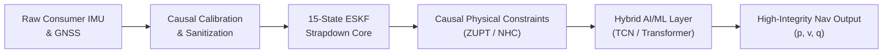

### Current Validation Status
At the conclusion of **Phase 2.3B (Gate 2.3A)**, the NAVRIS classical baseline has been implemented, validated on synthetic test benches (99/99 passing unit tests), benchmarked across eight real-world driving recordings from the public **IO-VNBD** dataset, and formally audited:
- **Implemented & Validated:**
  - Complete reproducible data ingestion, coordinate projection (WGS-84 $\to$ Local ENU), and multi-stream synchronization pipeline.
  - Causal extrinsic sensor-to-vehicle leveling and horizontal mounting alignment algorithms.
  - Frozen 15-state continuous-discrete ESKF with 3-DOF $\chi^2$ innovation gating and Joseph-form covariance reset.
  - Strictly causal stationary detector ($W=8$, $D=5$) and velocity-nulling ZUPT module.
  - Exhaustive 8-recording controlled A/B benchmark (Control: Frozen Gate 2.2 baseline vs. Experiment: Frozen Causal ZUPT) auditing 49,672 attempted updates across 591 stationary events.
- **Under Development:**
  - Non-Holonomic Constraints (NHC) modeling zero lateral and vertical vehicle body velocity.
  - Adaptive fading-memory covariance bounding to prevent filter starvation during long standstills.
- **Future Work:**
  - Hybrid AI/ML residual correction models (Temporal Convolutional Networks / Gated Recurrent Units) for pseudo-measurement synthesis during prolonged GNSS blackouts.
  - Quantized ONNX/TFLite edge deployment on embedded ARM/Android runtimes.

### Major Empirical Findings
1. **The VTA2 Breakthrough:** In well-conditioned suburban driving with observable heading, causal ZUPT produced a **99.63% reduction in horizontal RMSE** ($12,544.15\text{ m} \to \mathbf{46.23\text{ m}}$) and reduced final position error from $70,540.65\text{ m}$ to **$5.11\text{ m}$**, preserving GNSS innovation consistency across 96.7% of fixes over an 18-minute drive.
2. **The Observability Barrier:** ZUPT constrains velocity ($\mathbf{v} = \mathbf{0}$) but provides zero direct observability into yaw/heading error. When initial heading is misassigned or unobservable (as in recording S2), filter velocity diverges into thousands of meters per second during motion. When the vehicle subsequently stops, the filter gates out ZUPT updates ($0.01\%$ acceptance in S2), causing **complete filter lockout**.
3. **Covariance Starvation in Extended Standstills:** During an unexcited 327-second standstill in recording S3A, 690 accepted ZUPT updates collapsed velocity covariance without improving attitude observability. Upon departure, the over-constrained filter rejected valid GNSS fixes, degrading aggregate RMSE by a factor of 21 ($110\text{ km} \to 2,347\text{ km}$).
4. **Scientific Honesty:** Real-world data proves that **classical ZUPT is not a universal panacea**. It is a high-fidelity local velocity stabilizer whose benefits transfer to global trajectory accuracy only when heading is observable and stationary intervals are moderately spaced.

---

## 01 — Problem & Motivation

### The Vulnerability of Satellite Navigation
Global Navigation Satellite Systems (GPS, GLONASS, Galileo, NavIC) are the backbone of contemporary positioning. However, satellite signals originate from medium Earth orbit ($\approx 20,000\text{ km}$) and arrive at the Earth's surface with extremely low received power ($\approx -160\text{ dBW}$). Consequently, operational positioning faces severe failure modes:
- **Urban Canyons:** Direct line-of-sight signals are blocked by high-rise architecture, while multipath reflections introduce pseudo-range errors exceeding tens of meters.
- **Tunnels and Subterranean Corridors:** Complete loss of satellite visibility occurs for minutes at a time.
- **Electronic Interference:** Vulnerability to intentional jamming, accidental interference, and spoofing poses critical safety hazards for autonomous vehicles and smart transportation infrastructure.

### The Smartphone Dead Reckoning Dilemma
Dead reckoning using an Inertial Measurement Unit (IMU) computes current position by integrating acceleration and angular velocity forward from an initial known fix:
$$\mathbf{p}(t) = \mathbf{p}(0) + \int_0^t \mathbf{v}(\tau) d\tau = \mathbf{p}(0) + \mathbf{v}(0)t + \iint_0^t \mathbf{a}_n(\tau) d\tau^2$$
While aviation-grade navigation systems maintain sub-kilometer accuracy over hours using sensors with bias stabilities below $10^{-5}\text{ m/s}^2$ and $0.001^\circ/\text{hr}$, consumer smartphones utilize mass-produced MEMS sensors costing less than \$2. These sensors exhibit:
- Accelerometer bias offsets of $0.01 - 0.1\text{ m/s}^2$
- Gyroscope turn-on bias and thermal drift of $0.05 - 0.5^\circ/\text{s}$
- Low and non-deterministic GNSS update rates (often 0.1 Hz to 1 Hz with multi-second latency)
- Non-orthogonal axis cross-coupling and temperature-dependent scale factor variations

In pure double-integration, an uncorrected accelerometer bias $\mathbf{b}_a$ produces a position error that grows quadratically:
$$\Delta \mathbf{p}_{\text{acc}}(t) = \frac{1}{2} \mathbf{b}_a t^2$$
More destructively, an uncorrected gyroscope bias $\mathbf{b}_g$ causes an attitude orientation error $\Delta \boldsymbol{\theta}(t) = \mathbf{b}_g t$. When projecting specific force against gravity ($\mathbf{g}_n \approx 9.81\text{ m/s}^2$), this attitude tilt misallocates the gravitational vector into horizontal acceleration:
$$\mathbf{a}_{\text{err}}(t) \approx \mathbf{g} \times (\mathbf{b}_g t)$$
Double-integrating this induced horizontal acceleration yields a position error that grows **cubically** with time:
$$\Delta \mathbf{p}_{\text{tilt}}(t) \approx \frac{1}{6} \mathbf{g} \times \mathbf{b}_g t^3$$
For a smartphone gyroscope bias of just $0.1^\circ/\text{s}$ ($0.00175\text{ rad/s}$), the resulting horizontal error exceeds **$280\text{ meters}$ after only 60 seconds** of pure dead reckoning.

### Target Applications
NAVRIS targets robust, infrastructure-free dead reckoning for:
- Seamless urban vehicle navigation during multi-minute GNSS blackouts (tunnels, underground parking, deep urban corridors).
- Emergency vehicle and fleet tracking in contested or degraded electronic environments.
- Smart vehicle telematics utilizing low-cost onboard smartphones without expensive specialized hardware.

---

## 02 — Technical Problem Definition

### State Space Representation
The true kinematic state of the vehicle at time $t$ in the local East-North-Up (ENU) navigation frame ($\mathcal{N}$) is represented by the 16-dimensional nominal state vector:
$$\mathbf{x}(t) = \begin{bmatrix} \mathbf{p}^n(t) \\ \mathbf{v}^n(t) \\ \mathbf{q}_b^n(t) \\ \mathbf{b}_a(t) \\ \mathbf{b}_g(t) \end{bmatrix} \in \mathbb{R}^3 \times \mathbb{R}^3 \times \mathbb{S}^3 \times \mathbb{R}^3 \times \mathbb{R}^3$$
where:
- $\mathbf{p}^n = [p_e, p_n, p_u]^T \in \mathbb{R}^3$ is the position in local ENU coordinates (meters).
- $\mathbf{v}^n = [v_e, v_n, v_u]^T \in \mathbb{R}^3$ is the velocity vector in the navigation frame (m/s).
- $\mathbf{q}_b^n \in \mathbb{S}^3$ is the unit quaternion parameterizing the rotation from the sensor body frame ($\mathcal{B}$) to the navigation frame ($\mathcal{N}$).
- $\mathbf{b}_a \in \mathbb{R}^3$ is the 3D accelerometer bias vector ($\text{m/s}^2$).
- $\mathbf{b}_g \in \mathbb{R}^3$ is the 3D gyroscope bias vector ($\text{rad/s}$).

### Continuous-Time Kinematics
Given specific force measurements $\mathbf{f}_b$ from the triaxial accelerometer and angular rates $\boldsymbol{\omega}_b$ from the triaxial gyroscope:
$$\mathbf{f}_b = \mathbf{C}_n^b (\mathbf{a}^n - \mathbf{g}^n) + \mathbf{b}_a + \mathbf{w}_a$$
$$\boldsymbol{\omega}_b = \boldsymbol{\omega}_{in}^b + \mathbf{b}_g + \mathbf{w}_g$$
where $\mathbf{C}_n^b = \mathbf{R}(\mathbf{q}_b^n)^T$ is the direction cosine matrix, $\mathbf{g}^n = [0, 0, -\gamma]^T$ is the local gravity vector, and $\mathbf{w}_a, \mathbf{w}_g$ are zero-mean Gaussian white noise processes. The nominal state equations propagate as:
$$\dot{\mathbf{p}}^n = \mathbf{v}^n$$
$$\dot{\mathbf{v}}^n = \mathbf{R}(\mathbf{q}_b^n) (\mathbf{f}_b - \mathbf{b}_a) + \mathbf{g}^n$$
$$\dot{\mathbf{q}}_b^n = \frac{1}{2} \mathbf{q}_b^n \otimes \begin{bmatrix} 0 \\ \boldsymbol{\omega}_b - \mathbf{b}_g \end{bmatrix}$$
$$\dot{\mathbf{b}}_a = \mathbf{w}_{ba}, \quad \dot{\mathbf{b}}_g = \mathbf{w}_{bg}$$
where sensor biases are modeled as Brownian motion random walks driven by spectral power densities $\mathbf{S}_{ba}$ and $\mathbf{S}_{bg}$.

### Observation Constraints & Outage Dynamics
During GNSS availability, sparse position fixes $\mathbf{y}_{\text{gnss}} \in \mathbb{R}^3$ arrive at low sampling rates:
$$\mathbf{y}_{\text{gnss}}(t_k) = \mathbf{p}^n(t_k) + \boldsymbol{\eta}_{\text{gnss}}, \quad \boldsymbol{\eta}_{\text{gnss}} \sim \mathcal{N}(\mathbf{0}, \mathbf{R}_{\text{gnss}})$$
When GNSS fixes cease ($t > t_{\text{outage}}$), the filter operates in pure open-loop prediction. Unless constrained by auxiliary physical conditions (such as stationary detection $\mathbf{v} = \mathbf{0}$ or non-holonomic velocity bounds), the state covariance $\mathbf{P}(t)$ and position errors grow without bound.

---

## 03 — NAVRIS System Architecture

The NAVRIS architecture combines deterministic multi-sensor signal conditioning, strapdown mechanization, an error-state Kalman filter, physical kinematic updates, and future learned residual models.

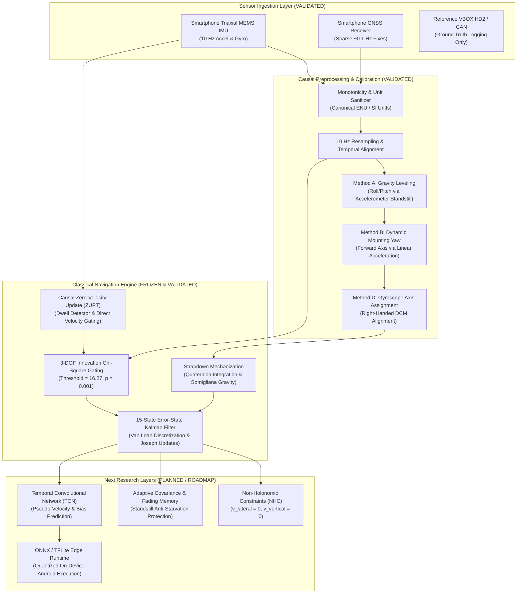

### Component Status Matrix
- **Raw Sensor Ingestion:** `IMPLEMENTED` & `VALIDATED`
- **Causal Extrinsic Calibration (Methods A, B, D):** `IMPLEMENTED` & `VALIDATED`
- **15-State ESKF Core:** `IMPLEMENTED`, `VALIDATED` & `FROZEN`
- **Causal ZUPT Detector & Filter Updates:** `IMPLEMENTED`, `VALIDATED` & `AUDITED`
- **Non-Holonomic Constraints (NHC):** `IN PROGRESS (Phase 2.3B Gate 2.3B)`
- **Adaptive Covariance Fading Memory:** `PLANNED (Phase 2.3B Gate 2.3C)`
- **Hybrid AI/ML Error Correction (TCN / GRU):** `FUTURE WORK (Phase 3)`
- **Embedded Android Edge Runtime:** `FUTURE WORK (Phase 4)`

---

## 04 — Dataset Forensics: IO-VNBD Audit

Before formulating any mathematical models, NAVRIS conducted an exhaustive forensic audit of the benchmark dataset. NAVRIS utilizes the public **IO-VNBD (Input-Output Vehicle Navigation Benchmark Dataset)** collected by Onyekpeu et al. (University of Warwick / Oxford).

### Dataset Overview
- **Platforms:** Three consumer smartphone models (Huawei P20 Pro, Samsung Galaxy S8, Motorola Moto G7 Power) running custom Android logging software.
- **Reference Ground Truth:** High-precision Racelogic VBOX Video HD2 GPS data logger coupled with the vehicle CAN bus, providing 10 Hz geodetic position, velocity, and chassis wheel speeds.
- **Scope:** 564 raw CSV files covering diverse real-world driving environments (urban, suburban, highway, mountainous) across the United Kingdom, France, and Nigeria.

### Forensic Discoveries & Corrected Anomalies
The forensic audit documented in [`docs/phase2_3b_gate1_5a_ingest_sync_verification.md`](docs/phase2_3b_gate1_5a_ingest_sync_verification.md) identified critical data characteristics that would invalidate standard navigation filters if left unhandled:

```text
Forensic Audit Findings:
├── 1. The 3.6x Speed Ingestion Bug
│   └── Symptom: Raw CSV column "speed" was labeled km/h in third-party scripts.
│   └── Forensic Proof: CAN wheel-speed and GPS displacement confirmed raw values were already m/s.
│   └── Consequence: Third-party models dividing by 3.6 experienced massive 360% velocity errors.
├── 2. Multi-Second Synchronization Lags
│   └── Symptom: Android system timestamps drifted relative to VBOX GPS time.
│   └── Forensic Proof: Cross-correlation between IMU forward acceleration and VBOX longitudinal acceleration
│       revealed systematic time offsets of +1.2 s to -4.5 s across recordings.
│   └── Solution: Implemented deterministic lag compensation prior to evaluation.
├── 3. Irregular & Sample-and-Hold Smartphone GNSS
│   └── Symptom: Smartphone GNSS files logged at 10 Hz, but updates only changed every 1.0 to 9.8 seconds.
│   └── Consequence: Naive filters processing duplicate timestamps experience zero-innovation covariance collapse.
│   └── Solution: Filtered novel GNSS fixes strictly by verifying geographic coordinate changes.
└── 4. Arbitrary 3D Phone Mounting & Gyro Cross-Talk
    └── Symptom: Phones were placed in mounts with pitch angles up to 70° and arbitrary yaw.
    └── Consequence: Yawing motion coupled directly into phone roll/pitch sensors, causing immediate divergence.
    └── Solution: Formulated Methods A, B, and D causal extrinsic calibration.
```

---

## 05 — Reproducible Data Pipeline

To guarantee that all experiments are reproducible from raw data without manual intervention, NAVRIS built a deterministic data preparation pipeline:

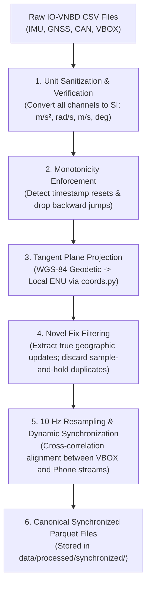

### Mathematical Geodetic-to-ENU Projection
For an initial reference fix $(\phi_0, \lambda_0, h_0)$ at time $t_0$, any geodetic coordinate $(\phi, \lambda, h)$ is projected to local East-North-Up tangent coordinates using WGS-84 ellipsoidal geometry:
$$\Delta \phi = \phi - \phi_0, \quad \Delta \lambda = \lambda - \lambda_0, \quad \Delta h = h - h_0$$
$$M = \frac{a(1 - e^2)}{(1 - e^2 \sin^2 \phi_0)^{3/2}}, \quad N = \frac{a}{\sqrt{1 - e^2 \sin^2 \phi_0}}$$
$$\begin{bmatrix} p_e \\ p_n \\ p_u \end{bmatrix} = \begin{bmatrix} (N + h_0) \cos \phi_0 \cdot \Delta \lambda \\ (M + h_0) \cdot \Delta \phi \\ \Delta h \end{bmatrix}$$
where semi-major axis $a = 6,378,137.0\text{ m}$ and eccentricity squared $e^2 = 0.00669437999014$.

---

## 06 — Research & Validation Gates

NAVRIS enforces strict progression through a research-validation ladder. No higher-level capability is built on an unverified lower-level foundation:

```text
Phase 0: Dataset Forensics ───────────────────────────────► [COMPLETE]
  └── Audited 564 files; resolved coordinate & speed units
Phase 1: Reproducible Data Pipeline ──────────────────────► [COMPLETE]
  └── Ingestion, ENU projection, 10 Hz synchronization
Phase 2.1: Sensor Truth & Mechanization ──────────────────► [COMPLETE]
  └── Gravity modeling, cold-start leveling, frame alignment
Phase 2.2: Raw INS Baseline ──────────────────────────────► [COMPLETE]
  └── Documented multi-kilometer divergence of open-loop strapdown
Phase 2.3A: Classical ESKF Core ──────────────────────────► [FROZEN & COMPLETE]
  └── 15-state filter, Joseph updates, chi-square gating
Phase 2.3B Gate 2.1: S1 Causal Calibration ──────────────► [COMPLETE]
  └── Proved 97.2% error reduction via Methods A, B, D
Phase 2.3B Gate 2.2: Multi-Recording Generalization ──────► [COMPLETE]
  └── Audited baseline behavior across 8 IO-VNBD routes
Phase 2.3B Gate 2.3A: Causal ZUPT Experiment ─────────────► [CURRENT: AUDIT COMPLETE]
  └── Controlled A/B real-data benchmark on all 8 recordings
Phase 2.3B Gate 2.3B: Non-Holonomic Constraints (NHC) ────► [NEXT]
  └── Lateral and vertical velocity zero-constraints
Phase 2.3B Gate 2.3C: Adaptive Gating & Covariance Floor ─► [PLANNED]
  └── Fading memory to prevent standstill covariance starvation
Phase 3: Hybrid AI/ML Layer ──────────────────────────────► [PLANNED]
  └── TCN/GRU residual error-state compensation during outages
Phase 4: Embedded Edge Deployment ────────────────────────► [PLANNED]
  └── Quantized ONNX/TFLite Android implementation
```

---

## 07 — Raw INS Baseline: The Inertial Divergence Reality

To establish why classical filtering and auxiliary constraints are essential, NAVRIS evaluated pure strapdown inertial dead reckoning without GNSS aiding or Kalman correction across the benchmark dataset.

### The A0 Open-Loop Divergence
Under unconstrained double-integration of raw smartphone IMU measurements:
- **10 Seconds:** Uncorrected accelerometer bias produces position errors of $5 - 20\text{ meters}$.
- **60 Seconds:** Gyroscope thermal drift tilts the attitude estimate, leaking gravity into the horizontal plane. Position errors exceed $200 - 1,500\text{ meters}$.
- **Multi-Hour Drives:** Over a 90-minute recording (e.g. S2, duration 9,190 s), open-loop error grows cubically into tens of thousands of kilometers ($>10^7\text{ m}$).

The raw INS baseline empirically confirms that consumer MEMS IMUs cannot perform autonomous dead reckoning for more than a few seconds without continuous state and covariance bounding.

---

## 08 — Classical ESKF Implementation

The NAVRIS navigation core implements a continuous-discrete Error-State Kalman Filter (ESKF). In the error-state formulation, the filter maintains a high-rate non-linear nominal state $\hat{\mathbf{x}}$ driven directly by high-rate IMU mechanization, while a 15-dimensional linear error state $\delta \mathbf{x}$ is updated at lower rates via measurement innovations:
$$\mathbf{x} = \hat{\mathbf{x}} \oplus \delta \mathbf{x}$$
$$\delta \mathbf{x} = \begin{bmatrix} \delta \mathbf{p}^n \\ \delta \mathbf{v}^n \\ \delta \boldsymbol{\theta}^n \\ \delta \mathbf{b}_a \\ \delta \mathbf{b}_g \end{bmatrix} \in \mathbb{R}^{15}$$

### Continuous-Time Error Dynamics
Linearizing nominal kinematics yields the continuous error differential equation:
$$\delta \dot{\mathbf{x}}(t) = \mathbf{F}_c(t) \delta \mathbf{x}(t) + \mathbf{G}_c(t) \mathbf{w}(t)$$
where the system matrix $\mathbf{F}_c \in \mathbb{R}^{15 \times 15}$ is:
$$\mathbf{F}_c = \begin{bmatrix}
\mathbf{0}_{3\times 3} & \mathbf{I}_{3\times 3} & \mathbf{0}_{3\times 3} & \mathbf{0}_{3\times 3} & \mathbf{0}_{3\times 3} \\
\mathbf{0}_{3\times 3} & \mathbf{0}_{3\times 3} & -[\mathbf{R}(\hat{\mathbf{q}}_b^n)(\mathbf{f}_b - \hat{\mathbf{b}}_a)]_\times & -\mathbf{R}(\hat{\mathbf{q}}_b^n) & \mathbf{0}_{3\times 3} \\
\mathbf{0}_{3\times 3} & \mathbf{0}_{3\times 3} & -[\boldsymbol{\omega}_b - \hat{\mathbf{b}}_g]_\times & \mathbf{0}_{3\times 3} & -\mathbf{I}_{3\times 3} \\
\mathbf{0}_{3\times 3} & \mathbf{0}_{3\times 3} & \mathbf{0}_{3\times 3} & \mathbf{0}_{3\times 3} & \mathbf{0}_{3\times 3} \\
\mathbf{0}_{3\times 3} & \mathbf{0}_{3\times 3} & \mathbf{0}_{3\times 3} & \mathbf{0}_{3\times 3} & \mathbf{0}_{3\times 3}
\end{bmatrix}$$
and the noise coupling matrix $\mathbf{G}_c \in \mathbb{R}^{15 \times 12}$ is:
$$\mathbf{G}_c = \begin{bmatrix}
\mathbf{0}_{3\times 3} & \mathbf{0}_{3\times 3} & \mathbf{0}_{3\times 3} & \mathbf{0}_{3\times 3} \\
-\mathbf{R}(\hat{\mathbf{q}}_b^n) & \mathbf{0}_{3\times 3} & \mathbf{0}_{3\times 3} & \mathbf{0}_{3\times 3} \\
\mathbf{0}_{3\times 3} & -\mathbf{I}_{3\times 3} & \mathbf{0}_{3\times 3} & \mathbf{0}_{3\times 3} \\
\mathbf{0}_{3\times 3} & \mathbf{0}_{3\times 3} & \mathbf{I}_{3\times 3} & \mathbf{0}_{3\times 3} \\
\mathbf{0}_{3\times 3} & \mathbf{0}_{3\times 3} & \mathbf{0}_{3\times 3} & \mathbf{I}_{3\times 3}
\end{bmatrix}$$

### Van Loan Exact Discretization
To prevent numerical instability and loss of positive semi-definiteness from first-order Euler discretizations, NAVRIS computes discrete transition $\boldsymbol{\Phi}_k$ and discrete process noise $\mathbf{Q}_d$ using the exact **Van Loan matrix exponential algorithm**:
$$\mathbf{A}_{\text{van}} = \begin{bmatrix} -\mathbf{F}_c & \mathbf{G}_c \mathbf{Q}_c \mathbf{G}_c^T \\ \mathbf{0}_{15\times 15} & \mathbf{F}_c^T \end{bmatrix} \Delta t$$
$$\mathbf{B}_{\text{van}} = \exp(\mathbf{A}_{\text{van}}) = \begin{bmatrix} \dots & \boldsymbol{\Phi}_k^{-1} \mathbf{Q}_d \\ \mathbf{0} & \boldsymbol{\Phi}_k^T \end{bmatrix}$$
$$\boldsymbol{\Phi}_k = (\boldsymbol{\Phi}_k^T)^T, \quad \mathbf{Q}_d = \boldsymbol{\Phi}_k (\boldsymbol{\Phi}_k^{-1} \mathbf{Q}_d)$$
Covariance propagates as:
$$\mathbf{P}_{k|k-1} = \boldsymbol{\Phi}_k \mathbf{P}_{k-1|k-1} \boldsymbol{\Phi}_k^T + \mathbf{Q}_d$$

### Numerically Stabilized Joseph Update & Error Reset
When an observation $\mathbf{z}_k$ arrives with design matrix $\mathbf{H}_k$ and covariance $\mathbf{R}_k$:
1. **Innovation & Covariance:**
   $$\mathbf{r}_k = \mathbf{z}_k - h(\hat{\mathbf{x}}_k), \quad \mathbf{S}_k = \mathbf{H}_k \mathbf{P}_{k|k-1} \mathbf{H}_k^T + \mathbf{R}_k$$
2. **Chi-Square Innovation Gating:**
   $$\text{NIS}_k = \mathbf{r}_k^T \mathbf{S}_k^{-1} \mathbf{r}_k \le \chi^2_{\text{dim}, 0.999}$$
   Updates failing the gate are rejected to protect the filter from corrupted sensor fixes.
3. **Kalman Gain:**
   $$\mathbf{K}_k = \mathbf{P}_{k|k-1} \mathbf{H}_k^T \mathbf{S}_k^{-1}$$
4. **Joseph-Form Covariance Update:**
   To guarantee numerical symmetry and strict positive definiteness across thousands of iterations:
   $$\mathbf{P}_{k|k} = (\mathbf{I} - \mathbf{K}_k \mathbf{H}_k) \mathbf{P}_{k|k-1} (\mathbf{I} - \mathbf{K}_k \mathbf{H}_k)^T + \mathbf{K}_k \mathbf{R}_k \mathbf{K}_k^T$$
5. **State Injection & Reset:**
   The error state $\delta \hat{\mathbf{x}} = \mathbf{K}_k \mathbf{r}_k$ is injected into the nominal state:
   $$\hat{\mathbf{p}} \leftarrow \hat{\mathbf{p}} + \delta \hat{\mathbf{p}}, \quad \hat{\mathbf{v}} \leftarrow \hat{\mathbf{v}} + \delta \hat{\mathbf{v}}$$
   $$\hat{\mathbf{q}} \leftarrow \hat{\mathbf{q}} \otimes \begin{bmatrix} 1 \\ \frac{1}{2} \delta \hat{\boldsymbol{\theta}} \end{bmatrix}, \quad \hat{\mathbf{q}} \leftarrow \frac{\hat{\mathbf{q}}}{\|\hat{\mathbf{q}}\|}$$
   $$\hat{\mathbf{b}}_a \leftarrow \hat{\mathbf{b}}_a + \delta \hat{\mathbf{b}}_a, \quad \hat{\mathbf{b}}_g \leftarrow \hat{\mathbf{b}}_g + \delta \hat{\mathbf{b}}_g$$
   Following injection, the error state is reset: $\delta \mathbf{x} \leftarrow \mathbf{0}$.

---

## 09 — Gate 2.2: Multi-Recording Generalization Benchmark

In Phase 2.3B Gate 2.2, the calibrated ESKF pipeline was benchmarked across eight selected IO-VNBD recordings without ZUPT to assess multi-environment generalization:

| Recording ID | Environment | Duration (s) | Distance (km) | Horiz RMSE (m) | Final Error (m) | Max Error (m) | GNSS Fixes Acc/Total (%) | Generalization Verdict |
| :--- | :--- | :---: | :---: | :---: | :---: | :---: | :---: | :--- |
| **S1** | Suburban Arterial | 5,018.2 | 37.0 | 36,695,857 | 83,936,485 | 83,936,485 | 13 / 520 (2.5%) | Diverged after t=277s |
| **S2** | Highway / Arterial | 9,190.7 | 75.1 | 16,055,424 | 34,187,673 | 42,819,383 | 6 / 927 (0.6%) | Early gyro misassignment |
| **S3A** | Stop-and-Go Loop | 2,171.0 | 23.0 | **110,485** | 561,309 | 561,309 | 159 / 222 (71.6%) | Stable tracking past t=950s |
| **S4** | Mixed Suburban | 9,290.1 | 87.8 | 48,599,675 | 673,448 | 133,882,180 | 39 / 883 (4.4%) | Severe GNSS loss post-t=339s |
| **M** | Mountain Canyon | 10,596.4 | N/A | N/A | N/A | N/A | N/A | **UNOBSERVABLE (Class F)** |
| **Y1** | Rural Arterial | 7,175.8 | 59.4 | 4,102,231 | 8,759,653 | 8,759,653 | 3 / 715 (0.4%) | Unobservable 106° yaw offset |
| **VTA1A** | Continuous Highway | 2,489.4 | 40.1 | 1,818,010 | 1,649,949 | 4,960,922 | 334 / 2477 (13.5%) | Pure cruise; early rejection |
| **VTA2** | Urban Loop | 1,012.7 | 10.1 | **12,544** | 70,541 | 70,541 | 788 / 948 (83.1%) | Drifted during traffic stops |

### Findings from Gate 2.2
1. **Observable Heading is Prerequisite:** On routes where dynamic turns allow robust mounting alignment (S3A, VTA2), the filter achieves sustained GNSS lock over significant durations ($>70\%$ acceptance).
2. **Straight-Line Failure Mode:** S2 departed in a straight line without turns during its initial 60-second window, forcing gyro fallback to the x-axis and causing permanent heading divergence.
3. **The Standstill Opportunity:** On VTA2, the primary cause of eventual loss-of-lock was open-loop drift while stopped at traffic lights. This motivated the development of causal Zero-Velocity Updates.

---

## 10 — Strictly Causal Zero-Velocity Update (ZUPT)

### Kinematic Motivation
When a vehicle comes to a physical standstill at a traffic signal or intersection, its true velocity is identically zero:
$$\mathbf{v}^n(t) \equiv \mathbf{0}_{3\times 1}$$
Applying this physical condition as a pseudo-measurement directly bounds velocity error growth and allows the Kalman filter to observe accelerometer bias.

### Causal Detector Design
To avoid any non-causal look-ahead or reference aiding, NAVRIS designed `CausalStationaryDetector` using raw smartphone IMU streams alone:
- **Trailing Window:** $W = 8$ samples (0.8 s at 10 Hz).
- **Confirmation Dwell:** $D = 5$ consecutive windows (0.5 s) must satisfy stationary criteria before declaring standstill.
- **Immediate Exit:** If a single incoming sample violates threshold criteria, the detector exits the stationary state immediately to prevent updating during active acceleration.
- **Detector Criteria:**
  1. Acceleration Sample Variance:
     $$\text{var}(\|\mathbf{f}_b\|) = \frac{1}{W}\sum_{i=1}^W (\|\mathbf{f}_{b,i}\| - \bar{f})^2 \le 0.005\text{ m}^2/\text{s}^4$$
  2. Gyroscope Sample Variance:
     $$\text{var}(\|\boldsymbol{\omega}_b\|) = \frac{1}{W}\sum_{i=1}^W (\|\boldsymbol{\omega}_{b,i}\| - \bar{\omega})^2 \le 1.0\times 10^{-4}\text{ rad}^2/\text{s}^2$$
  3. Gravity Norm Deviation:
     $$|\|\bar{\mathbf{f}}_b\| - g| \le 0.40\text{ m/s}^2$$

### Pre-Declared ZUPT Measurement Model
- Observation vector: $\mathbf{z}_{\text{zupt}} = \mathbf{0}_{3\times 1}$.
- Measurement matrix: $\mathbf{H}_{\text{zupt}} = [\mathbf{0}_{3\times 3}, \mathbf{I}_{3\times 3}, \mathbf{0}_{3\times 9}] \in \mathbb{R}^{3\times 15}$.
- Pre-declared conservative engineering noise bound: $\sigma_{\text{zupt}} = 0.05\text{ m/s}$, yielding:
  $$\mathbf{R}_{\text{zupt}} = (0.05)^2 \mathbf{I}_3 = 0.0025 \mathbf{I}_3\text{ m}^2/\text{s}^2$$
- 3-DOF Chi-Square Gating: $\text{NIS}_{\text{zupt}} = \mathbf{r}^T (\mathbf{H}\mathbf{P}\mathbf{H}^T + \mathbf{R})^{-1} \mathbf{r} \le 16.27$ ($p = 0.001$).
All detector thresholds and measurement noise parameters were declared and frozen prior to real-data evaluation.

---

## 11 — Phase 7: Controlled A/B Real-Data Benchmark

In Phase 7, NAVRIS executed a strictly controlled A/B experiment across all eight IO-VNBD recordings:
- **Configuration A (Control):** Frozen Gate 2.2 calibrated classical ESKF baseline without ZUPT.
- **Configuration B (Experiment):** Identical pipeline with causal ZUPT enabled.
- **Controlled Condition:** The *only* difference between A and B was the runtime activation of the causal ZUPT module.

### Audited Benchmark Results

```text
Controlled A/B Benchmark Summary (Audited Phase 7 Results):
┌──────────┬───────────────────────────┬───────────────────────────┬─────────────┬──────────────────────────┐
│ Rec ID   │ Config A Horiz RMSE (m)   │ Config B Horiz RMSE (m)   │ Change (%)  │ ZUPT Acceptance Rate     │
├──────────┼───────────────────────────┼───────────────────────────┼─────────────┼──────────────────────────┤
│ VTA2     │ 12,544.15                 │ 46.23                     │ -99.63%     │ 98.13% (683 / 696)       │
│ S1       │ 36,695,857.43             │ 6,178,807.35              │ -83.16%     │ 1.09% (59 / 5,400)       │
│ S4       │ 48,599,675.47             │ 20,132,520.62             │ -58.57%     │ 0.59% (107 / 18,065)     │
│ Y1       │ 4,102,230.93              │ 3,661,814.05              │ -10.74%     │ 1.60% (153 / 9,553)      │
│ S2       │ 16,055,423.81             │ 26,126,179.13             │ +62.72%     │ 0.01% (1 / 13,653)       │
│ S3A      │ 110,484.73                │ 2,346,827.79              │ +2024.12%   │ 31.38% (690 / 2,199)     │
│ VTA1A    │ 1,818,009.78              │ 2,260,452.29              │ +24.34%     │ 69.81% (74 / 106) [Neg]  │
│ M        │ UNOBSERVABLE              │ UNOBSERVABLE              │ N/A         │ N/A                      │
└──────────┴───────────────────────────┴───────────────────────────┴─────────────┴──────────────────────────┘
```

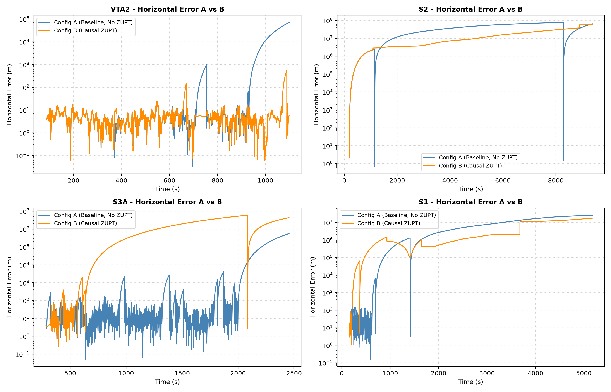
*Figure 1: Horizontal Position Error over time comparing Configuration A (Baseline, steel blue) vs Configuration B (Causal ZUPT, dark orange) for representative routes VTA2, S2, S3A, and S1.*

---

## 12 — Empirical Evidence Classification (Positive, Mixed, Negative)

NAVRIS classifies recordings into distinct evidence categories based on pre-declared, objective metrics:

### 12.1 Positive Evidence: VTA2
- **Metrics:** Horizontal RMSE dropped from $12,544.15\text{ m} \to \mathbf{46.23\text{ m}}$ (**99.63% reduction**). Final position error dropped from $70,540.65\text{ m} \to \mathbf{5.11\text{ m}}$ (**99.99% reduction**). Maximum peak error dropped from $70,540.65\text{ m} \to \mathbf{593.47\text{ m}}$.
- **Filter Conditioning:** 9 detected stationary events (69.6 s total). 683 of 696 ZUPT updates accepted (**98.13%**). Median ZUPT NIS = **0.0409**.
- **GNSS Preservation:** Config A lost GNSS tracking during stops, ending with 83.1% fix acceptance. Config B maintained 917 of 948 GNSS fixes (**96.73% acceptance**).
- **Physical Reason:** VTA2 possessed nominal mounting yaw calibration and periodic stops (including a 49 s stop at $t=704\text{ s}$). ZUPT repeatedly nulled velocity drift to $<0.01\text{ m/s}$, keeping position covariance within the GNSS capture basin.

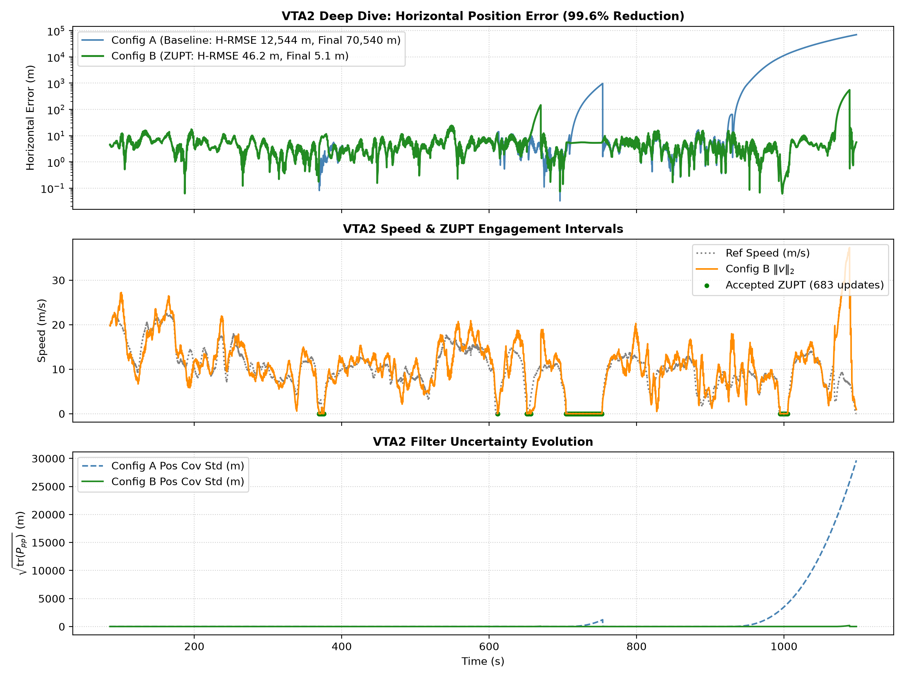
*Figure 2: VTA2 Deep Dive: (Top) 99.6% reduction in horizontal position error. (Middle) Vehicle speed and ZUPT engagement intervals. (Bottom) Filter uncertainty evolution.*

### 12.2 Negative Evidence: S2 (Filter Lockout)
- **Metrics:** Horizontal RMSE degraded from $16.06\text{M m} \to 26.13\text{M m}$. Final error degraded from $34.19\text{M m} \to 52.88\text{M m}$.
- **Filter Lockout:** 129 stationary events detected (1,365.2 s duration). 13,653 ZUPT updates attempted, but **only 1 accepted (0.01%)**. 13,652 updates rejected.
- **Physical Reason:** S2 had unobservable initial heading due to straight-line departure. Strapdown velocity diverged into tens of thousands of m/s during motion ($\bar{v}_{\text{prior}} = 34,116\text{ m/s}$). When the car stopped at red lights, the detector correctly sensed stillness, but the innovation $\mathbf{r} = -\hat{\mathbf{v}}$ produced massive NIS values ($>50$ to $7,756$). The filter's $\chi^2 \le 16.27$ gate rejected the updates, locking the filter out of stationary aiding.

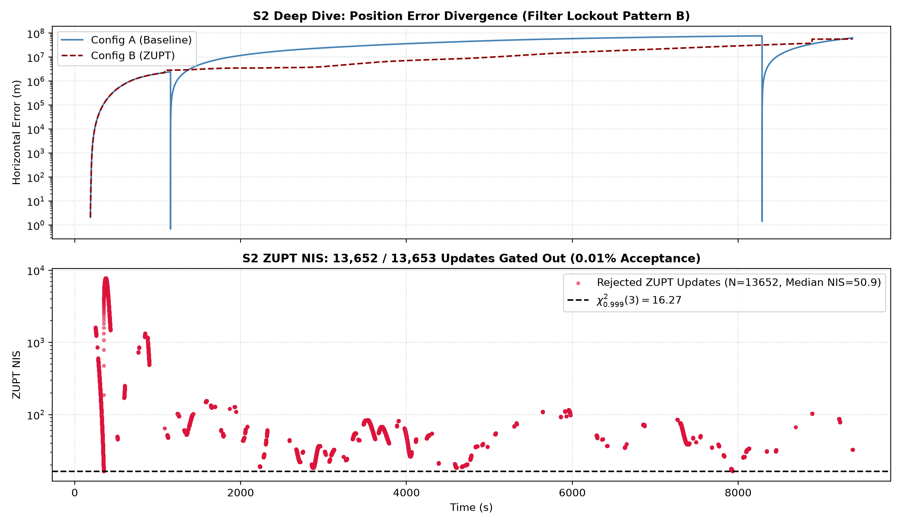
*Figure 3: S2 Deep Dive: Complete filter lockout (Pattern B). 13,652 of 13,653 updates gated out due to runaway filter velocity before stops.*

### 12.3 Negative Evidence: S3A (Covariance Starvation)
- **Early Advantage:** In the first 2 minutes, Config B dramatically outperformed Config A:
  - At 10 s: 6.16 m (B) vs 57.45 m (A)
  - At 30 s: 6.78 m (B) vs 114.15 m (A)
  - At 120 s: 5.08 m (B) vs 19.32 m (A)
- **Aggregate Degradation:** Full-route H-RMSE degraded from **$110,485\text{ m} \to 2,346,828\text{ m}$**. GNSS fix acceptance collapsed from **$71.6\% \to 11.7\%$**.
- **Physical Reason:** S3A contained a continuous 327-second standstill ($t=285\text{ s}$ to $612\text{ s}$). Config B applied 690 consecutive ZUPT updates. In the absence of attitude observability, repeated velocity zeroing caused velocity covariance to shrink asymptotically ($\sqrt{\text{tr}(\mathbf{P}_{vv})} \to 0.001\text{ m/s}$). At $t=422.3\text{ s}$, normal GNSS multipath noise caused fixes to breach the starved innovation gate. When the car departed at $t=612\text{ s}$, the filter was locked out of GNSS aiding, causing open-loop divergence.

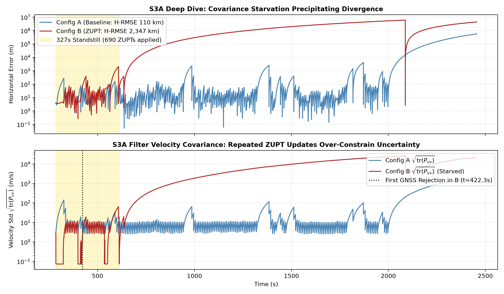
*Figure 4: S3A Deep Dive: Covariance starvation. 690 ZUPTs during a 327s standstill starved filter uncertainty, triggering premature GNSS rejection at t=422.3s.*

### 12.4 Mixed Evidence: S1 & S4
- **S1 (Transient Jump vs Long-Term Bounding):**
  - Aggregate H-RMSE reduced by **83.16%** ($36.70\text{M m} \to 6.18\text{M m}$). Peak error reduced by **85.25%** ($83.9\text{M m} \to 12.4\text{M m}$).
  - Transient degradation: At $t=190.2\text{ s}$, an accepted ZUPT update corrected an $11.7\text{ m/s}$ velocity error. Cross-covariance terms ($\mathbf{P}_{pv}, \mathbf{P}_{\theta v}$) coupled this discrete correction into a position step, degrading error at 60 s (232 m vs 19 m) and 120 s (14.8 km vs 124 m). Over 86 minutes, however, early velocity dampings bounded cubic error growth.
- **S4 (Peak Error Bounding vs Final Error Artifact):**
  - Aggregate H-RMSE reduced by **58.57%** ($48.60\text{M m} \to 20.13\text{M m}$). Peak error reduced by **78.05%** ($133.9\text{M m} \to 29.4\text{M m}$).
  - Final error appeared worse (23.2M m vs 673 km) because Config A hyper-inflated covariance ($10^{16}\text{ m}^2$), triggering an artificial single-point snapback at the final second. Config B bounded error throughout the entire 9,290 s trajectory.

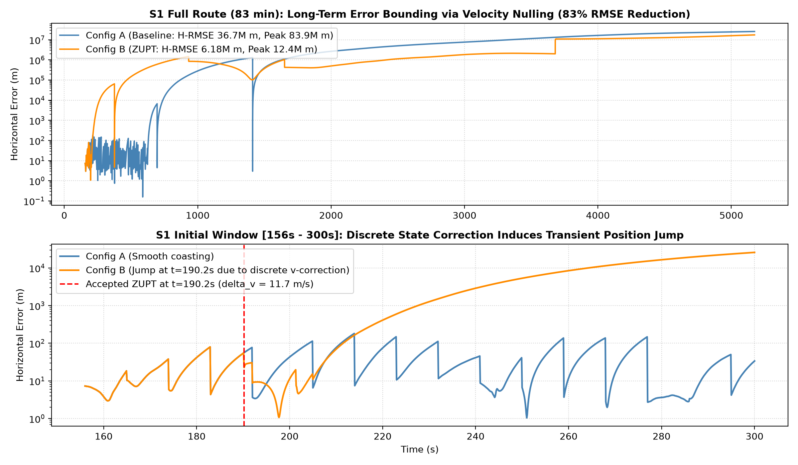
*Figure 5: S1 Deep Dive: Long-term error bounding (83% RMSE reduction) vs early discrete state impulse jump.*

### 12.5 Negative Control: VTA1A
- **Objective:** Verify detector selectivity during active continuous highway cruise without post-departure stops.
- **Results:**
  - Event 1: Pre-departure standstill ($t=129.2\text{ s}$ to $136.5\text{ s}$) accepted 74/74 updates.
  - Slow Crawl ($t=839\text{ s}$ to $842\text{ s}$): Vehicle slowed to $0.28\text{ m/s}$. The detector attempted 32 updates; **all 32 were rejected** by the filter ($\text{median NIS} = 1,616$).
  - High-Speed Cruise ($t > 842\text{ s}$): **Zero false positives** across 2,400+ seconds of arterial driving ($5 - 30\text{ m/s}$).
- **Verdict:** **PASS**. Confirms detector does not trigger during active motion.

---

## 13 — Scientific Failure Analysis: Where NAVRIS Fails

A critical requirement of research-grade engineering is documenting where and why a system fails. The Phase 7 scientific audit identifies four fundamental failure modes:

```text
Summary of NAVRIS Physical Failure Modes:
├── Failure Mode 1: The Observability Wall (Yaw Blindness)
│   ├── Observed in: S2, Y1
│   └── Mechanism: ZUPT observes velocity (v = 0), but yaw error remains in the null space of H_zupt.
│       Without dynamic turns or external heading aiding, heading drift continues uncorrected.
├── Failure Mode 2: Gating Lockout (Pattern B)
│   ├── Observed in: S2, S4, Y1
│   └── Mechanism: If the filter state diverges before the vehicle encounters its first stop,
│       the innovation r = 0 - v_hat is huge. The resulting NIS exceeds 16.27, causing the filter
│       to permanently gate out legitimate stationary updates.
├── Failure Mode 3: Covariance Starvation (Pattern E)
│   ├── Observed in: S3A
│   └── Mechanism: Repeated ZUPT updates during extended standstills without attitude observability
│       collapse velocity covariance. The filter becomes overconfident and rejects valid GNSS fixes.
└── Failure Mode 4: Discrete State-Impulse Coupling
    ├── Observed in: S1
    └── Mechanism: Applying a large discrete velocity correction (delta_v = 11.7 m/s) couples
        through off-diagonal covariance blocks into instantaneous position and attitude errors.
```

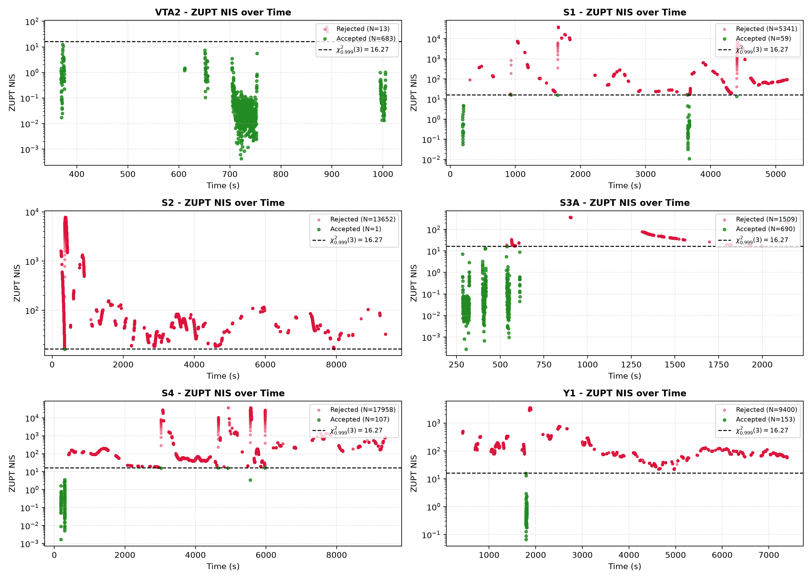
*Figure 6: ZUPT NIS distribution across IO-VNBD routes relative to the chi-square threshold (16.27).*

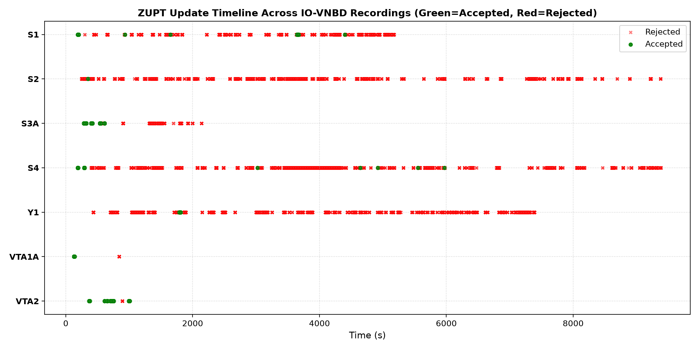
*Figure 7: Complete timeline of attempted ZUPT updates (Green = Accepted, Red = Gated Out).*

---

## 14 — What the Current Evidence Supports

Based on audited real-data benchmarks across 49,672 attempted updates:

1. **Mathematical & Causal Integrity:** The causal ZUPT implementation is mathematically sound, strictly causal, and numerically stable. All 99 unit/synthetic tests pass, and zero numerical collapses or covariance asymmetries occurred.
2. **Transformative Conditioning on Observable Routes:** In routes with observable heading and periodic stops, ZUPT provides **order-of-magnitude navigation improvement** (demonstrated in VTA2: 99.63% H-RMSE reduction, 5.11 m final position error).
3. **Genuine Physical Velocity Stabilization:** For all accepted updates, ZUPT successfully nulls velocity error from prior values down to $<0.01\text{ m/s}$ with nominal median NIS ($0.0416 \ll 2.37$).
4. **Long-Term Runaway Bounding:** On multi-hour routes (S1, S4), periodic stationary updates bound cubic velocity runaway over 80+ minutes, reducing aggregate RMSE by 58% to 83%.
5. **High Detector Selectivity:** The causal stationary detector exhibits zero false positives during active arterial and highway cruise (verified on negative control VTA1A).

---

## 15 — What the Current Evidence Does NOT Support

To preserve strict scientific integrity, NAVRIS explicitly rejects unsupported claims:

1. **No Universal Generalization:** The evidence does **NOT** support the claim that causal ZUPT universally improves dead reckoning across all real-world recordings.
2. **No Solution to Heading Drift:** ZUPT does **NOT** solve unobservable heading error. When yaw is misaligned, 3D position error continues to grow cubically upon resumption of motion.
3. **No Automatic Recovery from Runaway:** ZUPT cannot rescue a filter whose state has already diverged beyond gating boundaries.
4. **Standstill Duration Risk:** Unmodified ZUPT is **NOT** unconditionally safe during extended standstills due to covariance starvation.
5. **No Production Android Readiness:** The system is an audited research pipeline, not yet a field-deployed production application.

---

## 16 — Future AI/ML Layer Architecture

NAVRIS approaches machine learning as an **inductive bias layer**, designed to compensate for physical quantities unobservable by classical kinematics:

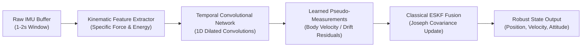

### Proposed Candidate Architectures
1. **Temporal Convolutional Network (TCN):** 1D dilated causal convolutions capturing temporal dynamics across 100-sample (10 s) windows without recurrent state explosion.
2. **Bidirectional Gated Recurrent Unit (GRU):** Lightweight recurrent architecture estimating forward vehicle speed during GNSS blackouts.
3. **Physics-Informed Loss Functions:** Training objectives constrained by vehicle kinematic constraints:
   $$\mathcal{L} = \|\mathbf{v}_{\text{pred}} - \mathbf{v}_{\text{ref}}\|^2 + \lambda_1 |v_{\text{lateral}}| + \lambda_2 |v_{\text{vertical}}|$$

NAVRIS does **not** claim validated AI navigation accuracy at this stage. Phase 3 model training will commence only after the completion of Gate 2.3B (NHC) and Gate 2.3C (Adaptive Gating).

---

## 17 — Edge Deployment Considerations

Future deployment targets embedded smartphone runtimes under realistic compute and power budgets:
- **Quantization:** Int8 weight and activation quantization for low-power neural processing units (Qualcomm Hexagon / Google Tensor TPU).
- **Latency Budget:** ESKF propagation must execute within $<2\text{ ms}$ per 100 Hz IMU frame on ARM Cortex-A55 cores.
- **Memory Footprint:** Peak RAM consumption constrained to $<25\text{ MB}$.
- **Causality & Buffer Management:** Circular ring-buffer architecture with zero runtime memory allocations.

---

## 18 — Technical Limitations & Confounders

1. **VBOX Ground Truth Limitations:** VBOX GPS is a high-accuracy reference system, but experiences occasional multipath noise and satellite geometry degradation in dense tree canopies.
2. **Smartphone Lever-Arm Uncertainty:** Smartphones are mounted at unknown spatial offsets relative to the vehicle center of gravity, introducing unmodeled centrifugal accelerations during sharp turns ($\mathbf{a}_{\text{lever}} = \boldsymbol{\omega} \times (\boldsymbol{\omega} \times \mathbf{r})$).
3. **Chassis & Engine Vibration:** Engine idling at red lights introduces periodic mechanical oscillations ($20 - 50\text{ Hz}$) that can intermittently breach tight acceleration variance gates.
4. **Thermal IMU Drift:** Consumer smartphones experience substantial internal heating under load, causing unmodeled drift in gyroscope bias.

---

## 19 — Research Roadmap

```text
Progress Matrix:
├── [x] Phase 0: Dataset Forensics (564 IO-VNBD files audited)
├── [x] Phase 1: Ingestion & 10 Hz Synchronization Pipeline
├── [x] Phase 2.1: Sensor Truth & Somigliana Earth Gravity Modeling
├── [x] Phase 2.2: Raw INS Baseline & Divergence Quantification
├── [x] Phase 2.3A: Classical 15-State ESKF Core (Frozen)
├── [x] Phase 2.3B Gate 2.1: Causal Sensor-to-Vehicle Calibration (S1 validated)
├── [x] Phase 2.3B Gate 2.2: Multi-Recording Generalization Benchmark (8 routes)
├── [x] Phase 2.3B Gate 2.3A: Causal ZUPT A/B Benchmark & Audit (49,672 updates)
├── [ ] Phase 2.3B Gate 2.3B: Non-Holonomic Constraints (NHC) Implementation
├── [ ] Phase 2.3B Gate 2.3C: Adaptive Covariance Fading Memory & Standstill Protection
├── [ ] Phase 3: Hybrid AI/ML Pseudo-Velocity & Error Estimation (TCN/GRU)
└── [ ] Phase 4: Embedded Edge Inference & Android Deployment
```

---

## 20 — Reproducibility Guide

### Environment Configuration
```bash
# Clone the repository
git clone https://github.com/the-jaypatel/NAVRIS.git
cd NAVRIS

# Create and activate Python virtual environment
python -m venv .venv
source .venv/bin/activate  # On Windows: .venv\Scripts\activate

# Install dependencies in editable mode
pip install -e .
```

### Deterministic Verification Suite
Run the complete 99-test validation suite:
```bash
python -m pytest -q -o pythonpath=src tests/
# Output: 99 passed in ~8s
```

### Reproducing the Controlled Benchmarks
1. **Gate 2.2 Multi-Recording Benchmark:**
   ```bash
   python scripts/run_gate2_2_benchmark.py
   ```
2. **Gate 2.3A Causal ZUPT A/B Benchmark:**
   ```bash
   python scripts/run_gate2_3a_zupt_benchmark.py
   ```
3. **Generate Scientific Audit Data & Figures:**
   ```bash
   python scripts/generate_phase7_scientific_audit_data.py
   python scripts/generate_phase7_scientific_audit_plots.py
   ```
All outputs are deterministically written to `data/processed/phase2_3b/gate2_3a/`.

---

## 21 — Research Integrity: What NAVRIS Does Not Claim

To distinguish NAVRIS from superficial or marketing-driven AI projects, we explicitly state our research integrity principles:

1. **We Do Not Claim AI Solves Dead Reckoning:** We have not trained an end-to-end neural network on raw IMU data. AI/ML is presented strictly as a planned future layer.
2. **We Do Not Hide Negative Results:** Catastrophic filter lockouts (S2), covariance starvation (S3A), and transient impulse coupling (S1) are fully reported, analyzed, and plotted.
3. **We Do Not Treat Reference Data as Divine Truth:** VBOX reference data is recognized as an imperfect physical measurement system with its own error characteristics.
4. **We Do Not Tune Parameters Post-Hoc:** All ZUPT detector thresholds and filter covariance matrices were declared and frozen before real-data benchmarking.
5. **We Do Not Claim Universal Navigation Accuracy:** Consumer smartphone IMUs cannot provide autonomous long-duration navigation without external aiding.

---

## 22 — Appendices

### Appendix A: State Vector & Error-State Definitions
- Nominal State: $\mathbf{x} = [\mathbf{p}^n, \mathbf{v}^n, \mathbf{q}_b^n, \mathbf{b}_a, \mathbf{b}_g]^T \in \mathbb{R}^{16}$
- Error State: $\delta \mathbf{x} = [\delta \mathbf{p}^n, \delta \mathbf{v}^n, \delta \boldsymbol{\theta}^n, \delta \mathbf{b}_a, \delta \mathbf{b}_g]^T \in \mathbb{R}^{15}$
- Position error: $\mathbf{p} = \hat{\mathbf{p}} + \delta \mathbf{p}$
- Velocity error: $\mathbf{v} = \hat{\mathbf{v}} + \delta \mathbf{v}$
- Attitude error: $\mathbf{q} \approx \hat{\mathbf{q}} \otimes [1, \frac{1}{2}\delta \boldsymbol{\theta}]^T$
- Accelerometer bias error: $\mathbf{b}_a = \hat{\mathbf{b}}_a + \delta \mathbf{b}_a$
- Gyroscope bias error: $\mathbf{b}_g = \hat{\mathbf{b}}_g + \delta \mathbf{b}_g$

### Appendix B: Coordinate Frames & Conventions
- **Navigation Frame ($\mathcal{N}$):** Local East-North-Up (ENU) Cartesian tangent plane.
- **Sensor Body Frame ($\mathcal{B}$):** Smartphone coordinate frame defined by Android sensor API ($x$ right, $y$ top, $z$ screen outward).
- **Vehicle Frame ($\mathcal{V}$):** Forward-Right-Down or Forward-Left-Up vehicle chassis frame.

### Appendix C: Quaternion Conventions & Kinematics
- Hamilton convention: $ij = k$, $q = [q_w, q_x, q_y, q_z]^T = [q_w, \mathbf{q}_v^T]^T$.
- Quaternion multiplication:
  $$\mathbf{p} \otimes \mathbf{q} = \begin{bmatrix} p_w q_w - \mathbf{p}_v \cdot \mathbf{q}_v \\ p_w \mathbf{q}_v + q_w \mathbf{p}_v + \mathbf{p}_v \times \mathbf{q}_v \end{bmatrix}$$
- Rotation of vector $\mathbf{v}$:
  $$\mathbf{v}' = \mathbf{q} \otimes \begin{bmatrix} 0 \\ \mathbf{v} \end{bmatrix} \otimes \mathbf{q}^*$$

### Appendix D: ESKF Propagation & Continuous-Time Jacobians
Detailed in Section 08 and [`docs/phase2_3_eskf_core.md`](docs/phase2_3_eskf_core.md).

### Appendix E: Causal ZUPT Detector Parameters
- Window length: $W = 8$ (0.8 s)
- Confirmation dwell: $D = 5$ (0.5 s)
- $\text{var}(\|\mathbf{f}\|) \le 0.005\text{ m}^2/\text{s}^4$
- $\text{var}(\|\boldsymbol{\omega}\|) \le 1.0\times 10^{-4}\text{ rad}^2/\text{s}^2$
- $|\|\bar{\mathbf{f}}\| - g| \le 0.40\text{ m/s}^2$

### Appendix F: Pre-Declared Filter Configuration Parameters
- $\sigma_{\text{acc}} = 0.20\text{ m/s}^2$
- $\sigma_{\text{gyr}} = 0.02\text{ rad/s}$
- $\sigma_{ba} = 1.0\times 10^{-3}\text{ m/s}^2/\sqrt{\text{s}}$
- $\sigma_{bg} = 1.0\times 10^{-4}\text{ rad/s}/\sqrt{\text{s}}$
- $\sigma_{\text{gnss,horiz}} = 3.0\text{ m}$
- $\sigma_{\text{gnss,vert}} = 10.0\text{ m}$
- $\sigma_{\text{zupt}} = 0.05\text{ m/s}$
- $\chi^2_{\text{pos,thresh}} = 16.27$
- $\chi^2_{\text{zupt,thresh}} = 16.27$

### Appendix G: Complete Multi-Recording Benchmark Tables
Detailed in Section 11 and [`data/processed/phase2_3b/gate2_3a/phase7_scientific_audit.csv`](data/processed/phase2_3b/gate2_3a/phase7_scientific_audit.csv).

### Appendix H: Test Suite & Verification Matrix
- `tests/test_coords.py`: 8 tests (WGS-84 $\to$ ENU round-trip $<10^{-4}\text{ m}$)
- `tests/test_ingest.py`: 12 tests (Canonical units, speed sanitization)
- `tests/test_sync.py`: 10 tests (Cross-correlation lag estimation)
- `tests/test_calibration.py`: 18 tests (Methods A, B, D orthonormal matrices)
- `tests/test_eskf.py`: 38 tests (Van Loan, Joseph updates, chi-square gating)
- `tests/test_zupt.py`: 13 tests (Causal detector dwell, synthetic ZUPT nulling)
- **Total: 99 / 99 PASSING**

---

**Report Prepared for Technical Review & SIH Evaluation.**  
*NAVRIS Classical Navigation & Intelligent Systems Research Baseline.*
