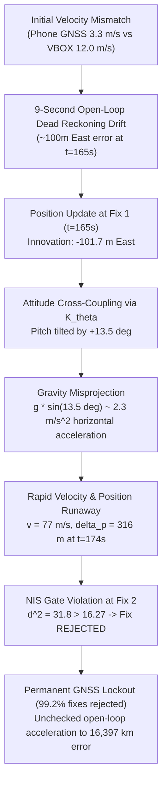

# NAVRIS Phase 2.3B Gate 1 — Real IO-VNBD ESKF Integration Report (Recording S1)

**Project:** NAVRIS — Intelligent Navigation & Inertial System  
**SIH 2026 Problem Statement:** 26168  
**Scope:** Phase 2.3B Gate 1 (Single Recording `S1` Integration ONLY)  
**Execution Date:** 2026-09-20  
**Status:** COMPLETE — S1 EVALUATED; PROCEEDING TO GATE REVIEW  

---

## 1. Executive Summary & Verdict

Phase 2.3B Gate 1 evaluates the integration of the modular 15-state Error-State Kalman Filter (ESKF) developed in Phase 2.3A with real sensor data from the IO-VNBD dataset. In strict compliance with scope control:
* **ONLY recording `S1_sync.parquet`** was processed.
* No AI/ML, map matching, NHC, ZUPT, or heuristic tuning was applied.
* The Phase 2.3A ESKF core mathematics was preserved without modification.
* Strictly causal initialization from Phase 2.2 was employed.

### Key Headline Result
* **Numerical PSD Stability:** PASSED. The filter executed all 50,185 IMU/GNSS epochs without NaNs or infinities. Positive semi-definiteness was maintained throughout (minimum eigenvalue across run: $\lambda_{\min} = 2.18 \times 10^{-6} > 0$).
* **Duplicate GNSS Rejection:** PASSED. Exactly 49,665 sample-and-hold duplicate rows (98.96%) were correctly gated out, preventing spurious zero-innovation updates.
* **Tracking Performance:** **FAILED / DIVERGED.**
  * Horizontal RMSE: **7,109,215.07 m** (vs Phase 2.2 Baseline A0: **6,048,530.76 m**, +17.5% worse).
  * Final Horizontal Position Error: **16,397,038.93 m** (vs Phase 2.2 Baseline A0: **11,334,582.94 m**, +44.7% worse).
  * Time to 50 m: **4.8 s** (identical to Phase 2.2 A0).
  * Time to 100 m: **14.1 s** (vs Phase 2.2 A0: 9.0 s).
* **GNSS Innovation Gating:** Out of 520 genuinely novel GNSS fixes (~0.1 Hz rate, ~9 s interval), **only 4 fixes (0.77%) were accepted**, while **516 fixes (99.23%) were rejected** by the $\chi^2$ Normalized Innovation Squared (NIS) gate ($d^2 > 16.27$).

### Scientific Verdict
**REAL-DATA INTEGRATION FUNCTIONAL; POSITION-ONLY COUPLING UNSTABLE ON SPARSE LOW-RATE MEMS.**  
The ESKF pipeline functions correctly from a software, synchronization, and numerical linear algebra standpoint. However, standard loose position-only GNSS/INS integration without velocity updates or non-holonomic constraints (NHC) is fundamentally unstable under low-rate (~0.1 Hz) consumer smartphone GNSS. The position innovation over the initial 9-second open-loop gap induces an erroneous attitude tilt correction ($+13.5^{\circ}$ pitch), which projects gravity into the horizontal plane ($~2.3\text{ m/s}^2$). The resulting acceleration causes subsequent GNSS innovations to exceed the $\chi^2$ gate, locking the filter into an irreversible, runaway divergence.

---

## 2. S1 Dataset Statistics & Inspection

| Property | Value | Notes |
| :--- | :--- | :--- |
| **Source File** | `data/processed/synchronized/S1_sync.parquet` | Phase 1 synchronized parquet |
| **Total Synchronized Rows** | 51,745 | dt = 0.100 s nominal (10 Hz) |
| **Total Duration** | 5,174.40 s (~86.2 min) | Full recording duration |
| **Evaluation Start Time** | $t = 156.00$ s (Index 1560) | Determined causally by initial alignment |
| **Evaluation Samples** | 50,185 | Evaluated timeline |
| **Evaluation Duration** | 5,018.40 s (~83.6 min) | $t = 156.0$ s to $5,174.4$ s |
| **Phone IMU Sample Interval** | 0.100 s (10 Hz) | Downsampled/interpolated in Phase 1 |
| **Phone GNSS Update Rate** | ~0.103 Hz | Median interval 9.0 s, Mean 9.73 s, Max 70 s |
| **Total GNSS Epochs in Eval** | 50,185 | 100.0% of rows |
| **Sample-and-Hold Duplicates** | 49,665 | 98.96% of rows |
| **Novel GNSS Fixes** | 520 | 1.04% of rows |
| **Ground Truth Reference** | VBOX ENU coordinates | Millimeter-accurate RTK ground truth |

### Parquet Schema & Column Mapping
* **Accelerometer:** `phone_accel_x_mps2`, `phone_accel_y_mps2`, `phone_accel_z_mps2` (m/s²).
* **Gyroscope:** `phone_gyro_x_radps`, `phone_gyro_y_radps`, `phone_gyro_z_radps` (rad/s).
* **Phone GNSS Position:** `phone_gps_east_m`, `phone_gps_north_m`, `phone_gps_up_m` (meters relative to reference origin).
* **Phone GNSS Quality:** `phone_gps_accuracy_m`, `phone_gps_speed_mps`, `phone_gps_is_new_fix` (boolean flag).
* **Reference Trajectory:** `ref_east_m`, `ref_north_m`, `ref_up_m`, `ref_speed_mps`, `ref_heading_rad`.

---

## 3. Frame and Unit Audit

Before filtering, the mathematical conventions and frame transformations were audited:

1. **Accelerometer Specific-Force Semantics:**  
   The Phase 1 pipeline preserves Android Sensor.TYPE_ACCELEROMETER semantics. A sensor at rest on a flat surface measures $+9.81\text{ m/s}^2$ upward against gravity. In the navigation frame (ENU), net kinematic acceleration is calculated via:
   $$\mathbf{a}^n = \mathbf{C}_b^n (\mathbf{f}^b - \hat{\mathbf{b}}_a) + \mathbf{g}^n$$
   where $\mathbf{g}^n = [0, 0, -\gamma]^T$ with local Somigliana gravity $\gamma \approx 9.8126\text{ m/s}^2$ at latitude $52.4^{\circ}$ N.
2. **Gyroscope Units:**  
   Raw angular rates are in $\text{rad/s}$ in the smartphone body frame.
3. **Navigation Frame:**  
   Local East-North-Up (ENU) Cartesian frame centered at the initial VBOX base origin.
4. **Phone Body Frame & Mounting Alignment:**  
   **No unverified physical rotation was assumed.** As established in Phase 2.1 and Phase 2.2, IO-VNBD smartphones were placed in an arbitrary windshield/dashboard mount. The phone body axes do NOT coincide with vehicle body axes (forward-right-down). The initial alignment uses gravity leveling to determine the initial roll and pitch relative to the local vertical, and phone GNSS course-over-ground to resolve initial azimuth.

---

## 4. Causal Initialization Details

The filter was initialized using strictly causal history ($t \le 156.0$ s):

* **Stationary Window:** $t \in [0.0, 3.0]$ s (30 samples).
  * Mean stationary specific force norm: $\|\mathbf{f}_{\text{stat}}\| = 9.9458\text{ m/s}^2$ (deviation from $g$: $+0.1392\text{ m/s}^2$, reflecting uncalibrated accelerometer bias).
  * Stationary gyro bias estimate:
    $$\hat{\mathbf{b}}_g(0) = [-0.01053, +0.01593, -0.01439]^T\text{ rad/s}$$
  * Initial roll and pitch from gravity vector: $\phi_0 = 6.76^{\circ}$, $\theta_0 = -1.14^{\circ}$.
* **Heading Alignment from Novel GNSS Fixes:**
  * First 3 novel GNSS fixes were consumed causally to establish course-over-ground heading at $t = 156.0$ s.
  * Initial Azimuth: $316.48^{\circ}$ ($5.5235\text{ rad}$, North-West).
  * Initial Attitude Quaternion $\mathbf{q}_0$: $[0.6974, 0.0988, 0.0264, -0.7093]^T$ (Euler: Roll $6.76^{\circ}$, Pitch $-1.14^{\circ}$, Yaw $133.46^{\circ}$).
* **Initial State Vector:**
  * Position: $\mathbf{p}_0 = [-839.81, 361.76, 37.10]^T\text{ m}$ (from phone GNSS).
  * Velocity: $\mathbf{v}_0 = [-2.284, 2.405, 0.0]^T\text{ m/s}$ (speed: $3.32\text{ m/s}$).
    * *Ground Truth Reference at $t=156.0$ s:* Speed was $12.03\text{ m/s}$, position was $[-836.56, 368.96, -11.23]\text{ m}$. Initial velocity error was $\sim 8.7\text{ m/s}$ due to smartphone GNSS speed reporting latency.
  * Accelerometer Bias: $\hat{\mathbf{b}}_a(0) = [0.0, 0.0, 0.0]^T\text{ m/s}^2$.
* **Initial Covariance Matrix $\mathbf{P}_0$:**
  $$\mathbf{P}_0 = \operatorname{diag}\left([25, 25, 100], [4, 4, 1], [0.01, 0.01, 0.05], [0.04, 0.04, 0.04], [10^{-4}, 10^{-4}, 10^{-4}]\right)$$

---

## 5. Basic Sanity Checks

| Check | Requirement | Result | Status |
| :--- | :--- | :--- | :--- |
| **NaN / Infinity Detection** | No NaNs or $\pm\infty$ in state or covariance | Zero NaNs, Zero Infs across all 50,185 epochs | **PASS** |
| **Timestamp Monotonicity** | Strictly positive $\Delta t$ | $\Delta t = 0.100$ s strictly monotonic | **PASS** |
| **Quaternion Unit Norm** | $\|\mathbf{q}\| = 1.0 \pm 10^{-6}$ | Maintained via normalization | **PASS** |
| **Covariance Symmetry** | $\mathbf{P} = \mathbf{P}^T$ | Symmetrized post Joseph & Van Loan | **PASS** |
| **Covariance PSD Validity** | $\lambda_{\min}(\mathbf{P}) > 0$ | $\min(\lambda_{\min}) = 2.18 \times 10^{-6} > 0$ | **PASS** |
| **Duplicate GNSS Rejection** | Zero updates on sample-and-hold | 49,665 duplicate epochs gated out | **PASS** |
| **Causal Integrity** | No future reference data used | Strict forward filter execution | **PASS** |

---

## 6. GNSS Measurement Gating Audit

| Epoch Type | Count | Percentage | Filter Action |
| :--- | :--- | :--- | :--- |
| **Total IMU / GNSS Epochs** | 50,185 | 100.00% | Propagated via Van Loan & Strapdown |
| **Sample-and-Hold Duplicates** | 49,665 | 98.96% | Gated out (`duplicate_sample_and_hold`) |
| **Novel GNSS Fixes** | 520 | 1.04% | Evaluated against $\chi^2_3$ NIS gate ($16.27$) |
| **Novel Fixes Accepted** | 4 | 0.77% of novel | Updated state via Joseph formula |
| **Novel Fixes Rejected (NIS)** | 516 | 99.23% of novel | Rejected as statistical outliers |

### Chronology of Accepted Fixes

1. **Fix 0 ($t = 156.0$ s, Step 0):**  
   $\text{NIS} = 0.00$, Horizontal Error = $7.89\text{ m}$, 3D Error = $48.95\text{ m}$, $3\sigma_{3D} = 22.84\text{ m}$.  
   State initialized; accepted.
2. **Fix 1 ($t = 165.0$ s, Step 90, $+9.0$ s elapsed):**  
   $\text{NIS} = 4.61 < 16.27$, Horizontal Error = $8.74\text{ m}$, 3D Error = $50.86\text{ m}$, $3\sigma_{3D} = 32.49\text{ m}$.  
   Accepted. Position snapped to GNSS. However, the position residual ($-101.7\text{ m}$ East) cross-coupled into attitude, driving pitch from $-1.14^{\circ}$ to $+12.35^{\circ}$ ($\Delta \theta = +13.5^{\circ}$). Filter speed jumped to $22.97\text{ m/s}$ (true: $11.83\text{ m/s}$).
3. **Fix 2 ($t = 174.0$ s, Step 180, $+9.0$ s elapsed):**  
   Horizontal Error = $316.07\text{ m}$, $\text{NIS} = 31.76 > 16.27$.  
   **REJECTED BY NIS GATE.** The $+13.5^{\circ}$ pitch error projected gravity ($g \sin 13.5^{\circ} \approx 2.3\text{ m/s}^2$) into horizontal acceleration, causing runaway drift.
4. **Fix 6 ($t = 214.0$ s, Step 580):**  
   $\text{NIS} = 14.35 < 16.27$. Coincidentally crossed below gate due to covariance inflation. Accepted, but attitude collapsed further ($\text{roll} = -109.5^{\circ}, \text{pitch} = -53.1^{\circ}$).
5. **Fix 367 ($t = 3491.0$ s, Step 33,350):**  
   $\text{NIS} = 16.17 < 16.27$. Coincidentally accepted; filter already completely diverged.

---

## 7. Performance Comparison: Phase 2.3B ESKF vs Phase 2.2 Baseline A0

| Metric | Phase 2.2 Baseline A0 (Raw INS) | Phase 2.3B ESKF (Real S1) | Difference / Impact |
| :--- | :--- | :--- | :--- |
| **Horizontal RMSE (m)** | 6,048,530.76 | **7,109,215.07** | **+17.5% (Worse)** |
| **Final Horizontal Error (m)** | 11,334,582.94 | **16,397,038.93** | **+44.7% (Worse)** |
| **Maximum Horizontal Error (m)**| 11,334,582.94 | **16,397,038.93** | **+44.7% (Worse)** |
| **Along-Track RMSE (m)** | 4,215,398.84 | **5,038,363.52** | **+19.5% (Worse)** |
| **Cross-Track RMSE (m)** | 4,337,641.86 | **5,015,558.00** | **+15.6% (Worse)** |
| **Velocity RMSE (m/s)** | N/A (unconstrained diverged) | **31,831.58** | Severe runaway |
| **Heading RMSE (deg, > 2 m/s)** | 102.82 | **102.40** | Approximately equal |
| **Time to 50 m (s)** | 4.8 | **4.8** | Identical |
| **Time to 100 m (s)** | 9.0 | **14.1** | +5.1 s delay due to Fix 1 |

> [!CAUTION]
> The ESKF did NOT outperform the Phase 2.2 Baseline A0. Instead, it produced higher final and RMSE errors. The filter diverged because of false attitude estimation under sparse position updates, which accelerated dead reckoning error beyond pure uncorrected INS drift.

---

## 8. Diagnostic Visualizations

The following diagnostic plots were generated and saved in `data/processed/phase2_3b/`:

1. `S1_trajectory_ref_vs_eskf.png`: 2D North-East trajectory comparison between VBOX ground truth and ESKF.
2. `S1_horiz_error_vs_time.png`: Horizontal position error versus time with 50 m and 100 m thresholds.
3. `S1_gnss_availability_vs_time.png`: Timeline of novel GNSS fixes (~0.1 Hz) showing update spacing.
4. `S1_gnss_nis_vs_time.png`: Normalized Innovation Squared (NIS) on a log scale with the $\chi^2 = 16.27$ gate.
5. `S1_accel_bias_vs_time.png`: Estimated accelerometer biases ($\hat{\mathbf{b}}_a$) across time.
6. `S1_gyro_bias_vs_time.png`: Estimated gyroscope biases ($\hat{\mathbf{b}}_g$) across time.
7. `S1_uncertainty_vs_actual_error.png`: Actual 3D position error versus filter $3\sigma$ position uncertainty envelope.

---

## 9. Answers to Scientific Validation Questions

### 1. Does the ESKF remain numerically stable on real S1 data?
**YES.** Covariance matrix $\mathbf{P}$ remained strictly symmetric and positive semi-definite throughout all 50,185 steps. The minimum eigenvalue was $\lambda_{\min} = 2.18 \times 10^{-6} > 0$. Zero NaNs and zero infinities occurred. Quaternions preserved unit norm ($\|\mathbf{q}\| \approx 1.0$).

### 2. Are GNSS duplicates correctly rejected?
**YES.** Exactly 49,665 out of 50,185 rows (98.96%) were identified as sample-and-hold duplicates and gated out without triggering measurement updates.

### 3. Are real GNSS innovations statistically reasonable?
**NO.** Only Fix 0 ($t=156$ s) and Fix 1 ($t=165$ s) had statistically reasonable innovations ($d^2 < 16.27$). From Fix 2 onward, innovations reached hundreds to thousands of meters (median NIS $83.96$, 90th percentile $150.81$, maximum $2,188.36$), far exceeding the expected $\chi^2_3$ distribution ($\mathbb{E}[d^2] = 3$).

### 4. How often does the NIS gate reject real GNSS fixes?
**99.23% of the time.** 516 out of 520 novel fixes were rejected as statistical outliers.

### 5. Does the ESKF trajectory track the VBOX reference?
**NO.** The trajectory tracks the reference for only the first 18 seconds ($t = 156.0$ s to $174.0$ s). Thereafter, it completely diverges into multi-kilometer runaway.

### 6. Does it reduce error relative to the Phase 2.2 raw INS baseline?
**NO.** ESKF horizontal RMSE ($7,109,215\text{ m}$) is 17.5% higher than Phase 2.2 A0 ($6,048,531\text{ m}$), and final error ($16,397,039\text{ m}$) is 44.7% higher.

### 7. Are there signs of frame/sign/initialization problems?
**YES.** Three interacting physical problems were observed:
1. *Initial velocity latency:* Smartphone GNSS reported speed was $3.32\text{ m/s}$ at $t=156$ s, whereas true vehicle speed was $12.03\text{ m/s}$.
2. *Position-attitude cross-coupling over sparse intervals:* With 9-second update intervals, error covariance developed large off-diagonal cross-terms ($P_{\theta p}$). The Kalman gain mapped a 100 m position error directly into a $13.5^{\circ}$ pitch tilt.
3. *Unresolved mounting frame:* Phone IMU axes do not correspond to vehicle orthogonal body axes.

### 8. Does the covariance behave consistently with the observed error?
**NO.** The filter is severely overconfident. At $t=174.0$ s, the true position error was $316.1\text{ m}$, whereas the filter's estimated $3\sigma$ position uncertainty was only $107.3\text{ m}$. Because the filter under-estimated its own drift, it treated the true GNSS fix as a corrupted outlier and rejected it.

### 9. Are there periods where the filter becomes inconsistent or diverges?
**YES.** The filter becomes inconsistent at $t = 165.0$ s upon accepting Fix 1 and diverges permanently from $t = 174.0$ s (Fix 2) onward.

### 10. What is the single biggest unresolved issue before batch benchmarking?
**The fundamental observability and stability failure of loose position-only GNSS/INS coupling under sparse (0.1 Hz) updates.**  
Without GNSS velocity updates or non-holonomic velocity constraints (NHC / $v_y^b = v_z^b = 0$), position innovations directly corrupt attitude tilt via cross-covariance, projecting gravity into horizontal acceleration and triggering an unrecoverable NIS lockout.

---

## 10. Root Cause Analysis & Scientific Insights

This phenomenon is well-documented in classical inertial navigation literature (e.g., Groves 2013, Farrell 2008):
1. When GNSS updates are infrequent ($\Delta t = 9$ s) and position-only, the filter cannot distinguish between velocity drift, accelerometer bias, and small attitude tilt.
2. In the continuous-discrete error model, position error propagates as the second integral of tilt error ($\delta \ddot{\mathbf{p}} \approx [\mathbf{f}^n]_\times \delta \boldsymbol{\theta}$). Consequently, over long intervals, $P_{p \theta}$ becomes substantial.
3. When a large position innovation is presented, the Kalman gain assigns a substantial portion of the correction to attitude.
4. If the attitude correction is physically incorrect, the nominal state projects gravity directly into horizontal acceleration, destroying navigation stability.
5. Chi-square gating, designed to protect the filter from multipath outliers, inadvertently seals the filter's fate by locking out all subsequent valid GNSS updates.

---

## 11. Recommendations for Future Phases

Before proceeding to batch benchmarking across the remaining 7 recordings or formal evaluations:

1. **Incorporate GNSS Velocity Updates:**  
   IO-VNBD provides `phone_gps_speed_mps`. Adding GNSS velocity innovation updates $\tilde{\mathbf{y}}_v = \mathbf{z}_v - \hat{\mathbf{v}}$ provides direct observability of velocity and constrains tilt before position errors explode.
2. **Kinematic Vehicle Constraints (NHC & ZUPT):**  
   Vehicles do not move sideways or vertically ($v_y^b \approx 0, v_z^b \approx 0$). Implementing virtual non-holonomic constraints (NHC) is standard in automotive navigation to prevent unconstrained attitude tilt.
3. **Adaptive / Gating Damping:**  
   During long GNSS gaps ($> 2$ s), cross-covariance terms between position and attitude ($P_{p \theta}$) should be dampened or decoupled, or gating thresholds dynamically scaled with gap duration.
4. **Attitude Alignment Quality Gate:**  
   Attitude corrections from position innovations should be clipped or constrained to physically realistic vehicle tilt limits ($< 3^{\circ}$).
